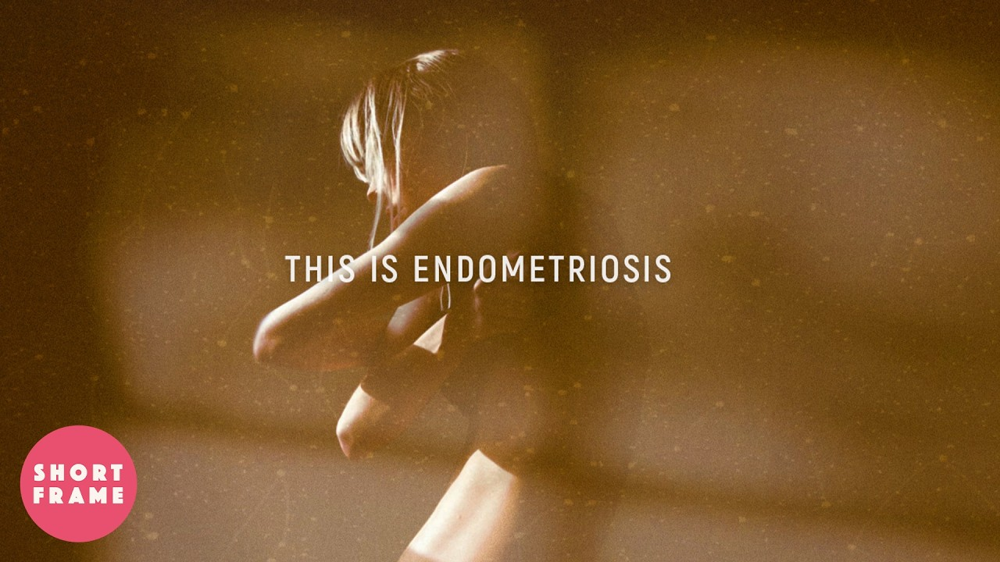

# Endo Adeno Resources Overview

> **Naming note:** This repository (`Awesome-Endo-Adeno-Resources`) is the source for the [1 in 7](https://1in7.info) website, published by Bloomed Health. Contributors should edit the content files in `content/` rather than the generated output in `dist/`.

*Welcome to your go-to resource for navigating the challenges of Endometriosis and Adenomyosis*. Diagnosis, symptom management, and treatment can be overwhelming, but it shouldn't be.

- [*Endometriosis*](https://en.wikipedia.org/wiki/Endometriosis): A chronic condition where tissue similar to the uterine lining grows outside the uterus, causing pain, heavy periods, and infertility.  
  [Approximately 10% of women and girls of reproductive age have Endometriosis](https://www.who.int/news-room/fact-sheets/detail/endometriosis) — around 190 million worldwide (WHO). In Australia, [the figure is estimated at 1 in 7](https://endometriosisaustralia.org/1-in-7-australian-women/), suggesting underdiagnosis globally.
- [*Adenomyosis*](https://en.wikipedia.org/wiki/Adenomyosis): A condition where endometrial tissue grows into the muscular wall of the uterus, leading to heavy menstrual bleeding, pain, and uterine enlargement.

**▶ This Is Endometriosis** — *BAFTA-winning documentary short film (2026) — Free to watch*

## Contents

<main id="main-content" role="main" aria-label="Main content">

- [Diagnosis](#diagnosis)
- [Vetted Physician and Healthcare Providers](#vetted-physician-and-healthcare-providers)
- [Diagnostic Tools and Platforms](#diagnostic-tools-and-platforms)
- [Medical Data Tools, Trackers, and Managers](#medical-data-tools-trackers-and-managers)
- [AI-Enabled Platforms and Ongoing Studies for Research](#ai-enabled-platforms-and-ongoing-studies-for-research)
- [Therapeutic Treatments](#therapeutic-treatments)
- [Potential Co-morbidities](#potential-co-morbidities)
- [Financial Assistance Platforms](#financial-assistance-platforms)
- [Advocacy Groups and Vetted Providers](#advocacy-groups-and-vetted-providers)
- [Regional Based Groups and Platforms](#regional-based-groups-and-platforms)
- [Fertility Resources](#fertility-resources)
- [Educational Materials](#educational-materials)
- [Community Sourced Data and Support](#community-sourced-data-and-support)

This resource list is packed with expert advice, community support, and the latest medical research insights, all aimed at making your life a little easier. Whether you're newly diagnosed or have been living with these conditions for a while, my hope is to offer guidance and support.

## Diagnosis

- [Endometriosis](https://en.wikipedia.org/wiki/Endometriosis)
  - Current Methods:
    - Laparoscopy remains the gold standard for definitive diagnosis.
    - Imaging techniques like MRI and ultrasound are used but may miss early or atypical cases.
    - New non-invasive blood tests (e.g., [Ziwig Endo Test](https://ziwig.com/en/ziwig-endotest/); [PromarkerEndo](https://www.proteomics.com.au/wp-content/uploads/PromarkerEndo-Brochure-Nov-2024.pdf)) have shown promise in detecting biomarkers associated with the disease. *Performance claims are manufacturer-reported; independent peer-reviewed validation is ongoing.*
  - Potential Indicators:
    - Presence of [Endometriomas](https://en.wikipedia.org/wiki/Endometrioma)
      - These are cysts filled with old blood. Endometriomas are a type of Endometriosis, but alternatively, Endometriosis does not mean that you have an Endometrioma.
- [Adenomyosis](https://en.wikipedia.org/wiki/Adenomyosis)
  - Current Methods:
    - Diagnosis is often based on symptoms, pelvic exams, and imaging (MRI or ultrasound).
    - Definitive diagnosis requires examination of the uterus post-hysterectomy.
  - Potential Indicators:
    - [Decidual Casts](https://ispub.com/IJGO/9/1/11420)
    - Excessive Bleeding during periods

### [Endometriosis Symptoms](https://www.ivf.com.au/blog/heres-the-four-stages-of-endometriosis)

<table role="table" aria-label="Endometriosis symptoms by stage and severity">
<caption>Endometriosis symptoms categorized by stage, severity, symptoms, and spread</caption>
<thead>
<tr>
<th scope="col">Stage/Type</th>
<th scope="col">Severity</th>
<th scope="col">Symptoms</th>
<th scope="col">Spread / Distribution</th>
</tr>
</thead>
<tbody>
<tr>
<td><strong>Stage I (Minimal)</strong></td>
<td>Mild</td>
<td>Mild or no pelvic pain; Possible infertility; Occasional dysmenorrhea</td>
<td>None</td>
</tr>
<tr>
<td><strong>Stage II (Mild)</strong></td>
<td>Mild to moderate</td>
<td>Moderate pelvic pain; Dysmenorrhea; Dyspareunia; Possible infertility</td>
<td>None</td>
</tr>
<tr>
<td><strong>Stage III (Moderate)</strong></td>
<td>Moderate</td>
<td>Chronic pelvic pain; Severe dysmenorrhea; Dyspareunia; Dyschezia; Infertility</td>
<td>Local spread</td>
</tr>
<tr>
<td><strong>Stage IV (Severe)</strong></td>
<td>Severe</td>
<td>Chronic, severe pelvic pain; Debilitating dysmenorrhea; Severe dyspareunia; Dyschezia; Dysuria; Infertility; Bowel/bladder dysfunction</td>
<td>Extensive local spread</td>
</tr>
<tr>
<td><strong>Deep Infiltrating (DIE)</strong></td>
<td>Very severe</td>
<td>All Stage IV symptoms plus: Intense chronic pelvic pain; Severe dyspareunia; Dyschezia, bowel obstruction possible; Dysuria, hydronephrosis possible; Organ dysfunction depending on affected areas (e.g., bowel, bladder, ureters)</td>
<td>Deep tissue involvement (bowel, bladder, ureters)</td>
</tr>
<tr>
<td><strong>Thoracic</strong></td>
<td>Very severe</td>
<td>Catamenial pneumothorax (lung collapse during menstruation); Hemoptysis (coughing up blood); Cyclic chest pain, shoulder pain, or dyspnea (shortness of breath); Hemothorax or pericardial effusion in severe cases</td>
<td>Distant sites such as the chest cavity</td>
</tr>
</tbody>
</table>

*rASRM staging describes anatomical extent (adhesions, implant size) — it does not correlate with pain severity. Stage I can cause debilitating symptoms and Stage IV can be asymptomatic.*

### [Adenomyosis Symptoms](https://asktia.com/article/adenomyosis-causes-symptoms-treatment/)

| Type/Stage   | Severity   | Symptoms   | Spread / Distribution   |
| ------------------- | --------------- | --------------- | --------------- |
| **Focal Adenomyosis**   | Mild to severe     | Localized uterine pain or tenderness; Heavy menstrual bleeding (menorrhagia); Dysmenorrhea (painful periods); Dyspareunia (painful intercourse); Pelvic pressure or fullness; Possible infertility   | Localized uterine involvement              |
| **Diffuse Adenomyosis** | Moderate to severe | Diffuse uterine pain or tenderness; Severe menorrhagia (heavy menstrual bleeding); Chronic pelvic pain; Dyspareunia; Significant uterine enlargement ("boggy" uterus); Anemia due to heavy bleeding; Infertility or miscarriage risk | Extensive uterine involvement              |
| **Stage 1: Early**      | Mild               | Minimal infiltration of endometrial tissue into the uterine wall; Symptoms often mild or non-existent             | None                                       |
| **Stage 2: Moderate**   | Moderate           | Increased infiltration of uterine wall tissue; Heavy and painful periods; Bloating and discomfort during intercourse   | None   |
| **Stage 3: Severe**     | Severe             | Severe infiltration leading to distortion of uterine shape; Escalating menstrual pain and flow intensity   | Possible localized spread                  |
| **Stage 4: Advanced**   | Very severe        | Extensive tissue infiltration causing significant uterine damage; Chronic pelvic pain, heavy bleeding, intermenstrual bleeding, and painful intercourse   | Potential damage to surrounding structures |

## Vetted Physician and Healthcare Providers

- [iCareBetter](https://icarebetter.com/)
  - Connecting as many Endo patients to the right [experts](https://icarebetter.com/endometriosis-specialist/) as early as possible
- [The Yellow Hub](https://www.theyellowhub.org/)
  - Empowering patient lives with compassionate tech
- [Roon](https://www.roon.com/)
  - Remote access to vetted medical experts
- [Hale](https://www.gethale.it/)
  - In-person and remote clinic to help those who suffer from Endometriosis, vulvodinia, and/or sexual pain. *In Italy*
- [Center for Endometriosis Care (CEC)](https://centerforendo.com/)
  - Pioneers in laparoscopic excision (LAPEX), specializing in the excisional approach to all Endometriosis including thoracic, bowel, and deep/complex disease. Offers free case reviews. *Atlanta, GA*
- [Nezhat Medical Center](https://endometriosisspecialists.com/)
  - Pioneered video-assisted laparoscopy; treats complex Endometriosis cases. *Atlanta, GA*
- [APTA Pelvic Health PT Locator](https://aptapelvichealth.org/ptlocator/)
  - Directory helping patients find licensed Physical Therapists who specialize in pelvic and abdominal health, with filters for Endometriosis expertise
- [Nancy's Nook Endometriosis Education](https://nancysnookendo.com/)
  - Founded by Nancy Petersen, RN; offers educational resources and a surgeon verification list. Note: not all surgeons on the list have the same skill level, experience, or treatment philosophies

## Diagnostic Tools and Platforms

- [Ziwig](https://ziwig.com/en/ziwig-endotest/)
  - A saliva test for Endometriosis providing a reliable diagnosis within just a few days
- [Qvin](https://qvin.com/)
  - Turn your monthly menstrual blood into lab reports and access personalized health data
- [Hertility Health](https://hertilityhealth.com/)
  - Provides comprehensive reproductive health testing and insights
- [Joii](https://joiicare.com/)
  - Advancing menstrual and gynaecological health research
- [Hera](https://www.herabiotech.com/)
  - Hera Biotech created a diagnostic tool, MetriDx™, designed to reduce the need for diagnostic laparoscopy. *Performance claims are manufacturer-reported; awaiting independent peer-reviewed validation.*
- [The Blood](https://www.theblood.io/)
  - The first menstrual blood fertility and menopause test
- [Afynia](https://afynia.com/)
  - Developing the first-ever microRNA-based molecular screen for Endometriosis, called EndomiR: EndomiR compares the expression levels of a panel of microRNAs with those from surgically confirmed cases of Endometriosis.
- [Diamens](https://www.eib.org/en/stories/diamens-at-home-test-endometriosis)
  - Diamens is still in the clinical development stage, but is working to develop an affordable at-home test to diagnose Endometriosis using menstrual blood

## Medical Data Tools, Trackers, and Managers

- Genetic Data Testing
  - [Invitae](https://www.invitae.com/)
    - Whole genome sequencing
  - [EndoGenomics](https://www.endogenomics.com/)
    - Endometriosis genomics
- Genetic Data Storage
  - [GenomesDAO](https://genomes.io/)
    - Genomes.io provides a private and secure DNA data vault
  - [Nebula Genomics](https://nebula.org/)
    - Nebula Genomics offers secure storage and analysis of whole genome sequencing data
- Trackers & Data Managers
  - [LasaHealth](https://www.lasahealth.com/)
    - Uses electronic health records to identify undiagnosed chronic pelvic pain patients using AI/machine learning algorithms
  - [Clue](https://helloclue.com/articles/cycle-a-z/how-to-track-endometriosis-symptoms-with-clue)
    - Endometriosis symptom tracker
  - [HerMaid](https://www.hermaid.me/en/frauengesundheit)
    - Women's Health management platform for symptom management, tracking, and recommendations
  - [NoEndo](https://www.noendo.fr/#/)
    - NoEndo is a French platform designed to help individuals affected by Endometriosis

## AI-Enabled Platforms and Ongoing Studies for Research

- [Scanvio](https://www.scanvio.com/)
  - Faster Endometriosis diagnosis with our AI-augmented ultrasound software
- [IMAGEENDO](https://imagendo.org.au/about/)
  - Reducing the diagnostic delay of Endometriosis through imaging
- [Perplexity.ai](https://www.perplexity.ai/)
  - Perplexity AI is a conversational search engine that uses large language models (LLMs) to answer queries
- [FEMaLe](https://findingendometriosis.eu/inovation/ai/)
  - The FEMaLe project will bring the revolution with the application of Augmented Reality (AR) in dealing with Endometriosis
- [Endometriosis Subtyping study by @guarelin](https://Github.com/Setia-Verma-Lab/endometriosis_subtyping)
  - Enhancing genetic association power in Endometriosis through unsupervised clustering of clinical subtypes identified from electronic health records

## Therapeutic Treatments

  
Click to expand Treatment Options

### Surgical Treatments

#### Endometriosis Treatments

- It is critical to note: Hysterecomy DOES NOT treat Endometriosis, only Adenomyosis

| Technique | Key Advantage | Provider Network |
|-----------|---------------|------------------|
| **Laparoscopic Excision Surgery** | Gold standard for Endometriosis treatment; removes lesions while preserving healthy tissue | Various specialized centers worldwide |
| **Nerve-Sparing Excision** | Preserves pelvic nerve plexus to reduce post-op chronic pain | Mayo Clinic; UCSF; EEL Centers |
| **Presacral Neurectomy** | Cuts nerves to uterus to relieve severe pelvic pain | Various specialized centers |
| **Lysis of Adhesions** | Removes scar tissue that can cause pain and infertility | Various specialized centers |
| **Resection of Deep Infiltrating Endometriosis (DIE)** | Targets removal of deeply infiltrating lesions affecting bowel, bladder, ureters | Various specialized centers |
| **Robotic-Assisted DIE Resection** | Enhanced precision for rectovaginal and bladder lesions | Memorial Sloan Kettering; Johns Hopkins |
| **Robotic-Assisted Surgery** | Enhanced precision and control for complex cases | Various specialized centers |

#### [Adenomyosis Treatments](https://asktia.com/article/adenomyosis-causes-symptoms-treatment/)

| Technique | Key Advantage | Provider Network |
|-----------|---------------|------------------|
| **Hysterectomy** | Surgical removal of uterus for severe cases not responding to other treatments | Various specialized centers |
| **Uterine Artery Embolization (UAE)** | Minimally invasive; blocks blood supply to affected areas; [92.3% improvement rate, 82% avoid hysterectomy long term](https://blog.nbir.com.au/alternative-to-hysterectomy-for-adenoymosis) | Various specialized centers |
| **Focal Adenomyoma Excision** | Conservative uterine-sparing removal | Centre for Reproductive Medicine (The Netherlands) |
| **Radiofrequency Ablation** | [68.1% pain reduction and fertility preservation potential](https://pmc.ncbi.nlm.nih.gov/articles/PMC8348135/) | Various specialized centers |
| **High-Intensity Focused Ultrasound (HIFU)** | [Non-surgical option using ultrasound waves for coagulative necrosis](https://pmc.ncbi.nlm.nih.gov/articles/PMC8348135/) | Various specialized centers |
| **Myomectomy** | Surgical removal of fibroids while preserving fertility | Various specialized centers |

### Non-Surgical Treatments

- Latest Advancements in Non-Surgical Diagnostics & Therapeutics for Endometriosis

| Method        | Key Features                                   | Advantages                                    | Limitations                               |
|--------------------------|-----------------------------------------------|-------------------------------------|-------------------------------------------|
| [PromarkerEndo](https://www.proteomics.com.au/) (Blood Test)| Identifies protein biomarkers  | Cost-effective, early-stage detection        | Requires further validation for global use |
| Electroviscerography (EVG)| Monitors gastrointestinal myoelectric activity| Non-invasive, experimental                   | Needs more clinical trials                |
| EVG-Guided Pelvic Floor Biofeedback | Uses EVG monitoring for targeted pelvic floor therapy | Personalized pelvic floor rehabilitation | Requires specialized equipment and training |
| Infrared Spectroscopy    | Spectrochemical analysis                      | Highly sensitive, non-invasive               | Early research stage                      |
| Imaging Innovations      | Advanced imaging technologies                 | Reliable alternative to surgery              | Clinical trials ongoing                   |
| [AI + Omics Integration](https://pubmed.ncbi.nlm.nih.gov/39926583/)   | Combines AI and molecular data                | Personalized diagnostics                     | Requires large-scale validation           |
| [Microbiome modulation](https://www.sciencedirect.com/science/article/pii/S1471491424001667)    | Gut–microbiota–brain axis recently emerged as a key player in neuro-pain pathways                | Personalized treatment                     | Needs More Developed Research           |

### Medicinal Treatments

  
Click to expand Medicinal Treatments

 As stated from [EndoWhat?](https://www.youtube.com/c/endowhat), "All medications aimed at "treating" Endometriosis only manage symptoms. They do not treat the disease itself. Drug therapy can suppress Endometriosis, not eradicate it."

#### Medication and Medicinal Supplements

- [Immunology and Immunotherapy of Endometriosis](https://pmc.ncbi.nlm.nih.gov/articles/PMC8708975/)
  - Research on the treatment of Endometriosis symptoms with Low Dose Naltrexone

#### Cannabis and Herbal

- [Lara Parker's Journey with Endometriosis](https://www.forbes.com/sites/javierhasse/2019/12/04/lara-parker/#16937b1561e2)
  - "Lara Parker shares her personal experience with Endometriosis and discusses various non-surgical treatment options."
- [Cannabis and Endometriosis: A Survey of Its Effectiveness](https://journals.plos.org/plosone/article?id=10.1371/journal.pone.0258940)
  - "This study explores the effectiveness of cannabis in managing Endometriosis symptoms, providing valuable insights into its potential benefits."
- [Cannabinoids Improve Symptoms in Mice with Endometriosis](https://elifesciences.org/for-the-press/84e17c36/cannabinoids-improve-symptoms-in-mice-with-endometriosis)
  - "This research highlights the potential of cannabinoids in alleviating Endometriosis symptoms in a mouse model."

#### Physical Therapy

- [Pelvic Health Physiotherapy: A Guide for People With Endometriosis](https://endometriosisnetwork.com/endo-hub/pelvic-health-physiotherapy-a-guide-for-people-with-endometriosis/)
  - Pelvic health physiotherapy is an effective, evidence‑based treatment for some symptoms of Endometriosis, like pain with sexual activity. It's also helpful for treating other conditions and diseases that many people with Endometriosis have, either independently or as a result of Endometriosis.
- [Herman & Wallace Pelvic Rehabilitation Institute](https://hermanwallace.com/)
  - Provider directory for pelvic floor specialists trained in Endometriosis treatment

#### Mental Health Support

- [Endometriosis Network Canada Mental Health Guide](https://endometriosisnetwork.com/)
  - Comprehensive guidance on therapy types (CBT, ACT, mindfulness) and crisis resources including 988 for immediate assistance
- Pain Psychology Specialists
  - Pain-informed therapists can help process medical trauma and arm patients with resources for navigating the medical system assertively. Look for therapists specializing in chronic pain management.

#### Nutrition & Anti-Inflammatory Resources

- [BC Women's Centre for Pelvic Pain & Endometriosis - Diet Recommendations](https://bcwomens.ca/)
  - Comprehensive anti-inflammatory dietary recommendations for chronic pelvic pain and Endometriosis
- Key evidence-based dietary findings:
  - Reducing dietary fat and increasing dietary fiber have been shown to reduce circulating estrogen concentrations
  - Anti-inflammatory properties of plant-based diets may benefit those with Endometriosis
  - A diet filled with antioxidants, PUFAs, vitamins D, C and E while avoiding processed foods, red meat, and animal fats may help

  
Click to expand Scientific Research and Findings

### Endometriosis

- [Comorbidity analysis and clustering of Endometriosis patients using electronic health records](https://www.sciencedirect.com/science/article/pii/S2666379125003180) (Khan et al., 2025)
  - **Groundbreaking study** analyzing >43,500 Endometriosis patients across six UC medical centers, identifying **over 600 disease correlations** and confirming Endometriosis as a **multi-system disorder**. Key findings include strongest associations with uterine adenomyosis (OR = 181), pelvic adhesions (OR = 51.1), and protective effects of hyperlipidemia (OR = 0.67). Study reveals distinct patient subgroups requiring personalized treatment approaches.
- [Endometriosis Typology and Ovarian Cancer Risk](https://jamanetwork.com/journals/jama/article-abstract/2821194)
  - "Those with Endometriosis had 4.2-fold higher ovarian cancer risk than those without Endometriosis. Those with ovarian [endometriomas](https://en.wikipedia.org/wiki/Endometrioma) and/or deep infiltrating Endometriosis, compared with no Endometriosis, had 9.7-fold higher risk"
- [Endometriosis and the risk of ovarian cancer: a meta-analysis](https://pubmed.ncbi.nlm.nih.gov/36988819/)
  - "The pooled odds ratio for Endometriosis and ovarian cancer was 4.2 (95% CI, 3.2 to 5.5)"
- [Novel Biomarkers for Endometriosis Diagnosis](https://www.ncbi.nlm.nih.gov/pmc/articles/PMC7891234/)
  - "Recent studies have identified several potential biomarkers, including microRNAs and cytokines, that could improve the accuracy of Endometriosis diagnosis."
- [Endometriosis Association with Gut Health and Inflammation](https://www.frontiersin.org/journals/reproductive-health/articles/10.3389/frph.2022.963752/full)
  - "This article explores the link between Endometriosis, gut health, and inflammation, suggesting that gut microbiota may play a role in the pathogenesis of Endometriosis and its associated symptoms."
- [Endometriosis: Pathophysiology and Management](https://www.mdpi.com/2227-9059/12/4/888)
  - "This study provides an overview of the pathophysiology of Endometriosis and discusses current management strategies, emphasizing the importance of personalized treatment approaches."

### Adenomyosis

- [Gonadotropin-releasing hormone antagonist in uterine adenomyosis](https://www.fertstert.org/article/S0015-0282(25)00518-7/fulltext)
  - "Oral gonadotropin-releasing hormone (GnRH) antagonists appear to offer a promising new potential treatment alternative, allowing dose-dependent control of estradiol levels with rapid reversibility and no flare-up effect."
- [Emerging Therapies for Adenomyosis Management](https://www.tandfonline.com/doi/full/10.1080/13625187.2021.1901234)
  - "New therapeutic approaches, including the use of GnRH antagonists and uterine artery embolization, are showing promise in the management of adenomyosis symptoms."
- [Systemic comorbidities in patients with adenomyosis](https://www.sciencedirect.com/science/article/pii/S1472648325003098)
  - "A prospective observational study compared the presence of comorbidities between patients with adenomyosis (n=342) and those with both adenomyosis and Endometriosis (n=347)."

## Potential Co-morbidities

### Data Source

De-identified EHRs using OMOP Common Data Model

### Research Foundation

  
Click to expand Key Findings

- **661 significantly enriched conditions** identified at UCSF
- **302 conditions replicated** across independent datasets (45% validation rate)
- **Strong correlation strength:** Pearson r = 0.864 between datasets
- **Patient clustering** reveals distinct subgroups requiring personalized treatment approaches

### Comorbidity Categories

  
Click to expand Comorbidity Categories

#### Gynecological Conditions (Strongest Associations)

| Comorbidity                                      | Prevalence in Endometriosis | Prevalence in Adenomyosis | Likelihood Rate                           | Population Percentage | Notes                                             |
| ------------------------------------------------ | --------------------------- | ------------------------- | ----------------------------------------- | --------------------- | ------------------------------------------------- |
| [**Uterine adenomyosis**](https://www.sciencedirect.com/science/article/pii/S2666379125003180)                          | **80.6%**                   | -                         | **Very High**                             | **80.6%**             | **OR = 181 (strongest association identified)**  |
| [**Pelvic peritoneal adhesions**](https://www.sciencedirect.com/science/article/pii/S2666379125003180)                  | **Significant**             | -                         | **Very High**                             | **Significant**       | **OR = 51.1**                                     |
| [**Crohn's disease**](https://www.sciencedirect.com/science/article/pii/S2666379125003180)                              | **Significant**             | -                         | **Moderate**                              | **Significant**       | **Inflammatory bowel condition with significant overlap** |
| [**Noninflammatory disorders of female genital organs**](https://www.sciencedirect.com/science/article/pii/S2666379125003180) | **Significant**        | -                         | **Very High**                             | **Significant**       | **OR = 30.2**                                     |
| Adenomyosis                                      | 80.6%                       | -                         | High                                      | 80.6%                 | High co-occurrence with Endometriosis             |
| Endometriosis                                    | -                           | 91.1%                     | High                                      | 91.1%                 | High co-occurrence with adenomyosis               |
| [Uterine Leiomyoma (Fibroids)](https://en.wikipedia.org/wiki/Uterine_fibroid)                     | Significant                 | Significant               | Moderate                                  | Significant           | Common in both conditions                         |
| Benign Ovarian Tumors                            | Significant                 | Significant               | Moderate                                  | Significant           | Common in both conditions                         |
| [Polycystic Ovarian Syndrome (PCOS)](https://en.wikipedia.org/wiki/Polycystic_ovary_syndrome)               | Strong association          | -                         | Moderate                                  | Significant           | More common with Endometriosis                    |
| Infertility                                      | Common                      | Common                    | High                                      | Common                | Can affect fertility in both conditions           |

#### Gastrointestinal Disorders

| Comorbidity                                      | Prevalence in Endometriosis | Prevalence in Adenomyosis | Likelihood Rate                           | Population Percentage | Notes                                             |
| ------------------------------------------------ | --------------------------- | ------------------------- | ----------------------------------------- | --------------------- | ------------------------------------------------- |
| [**Crohn's disease**](https://www.sciencedirect.com/science/article/pii/S2666379125003180)                              | **Significant**             | -                         | **Moderate**                              | **Significant**       | **Inflammatory bowel condition with significant overlap** |
| [Irritable Bowel Syndrome](https://www.ncbi.nlm.nih.gov/books/NBK56049/)                         | Common                      | -                         | Moderate                                  | Common                | Differentiation via Rome IV criteria essential; gut-directed therapy improves overall quality of life |
| [Gastroesophageal Reflux Disease (GERD)](https://www.ncbi.nlm.nih.gov/books/NBK56049/)           | Common                      | -                         | Moderate                                  | Common                | Frequently observed in Endometriosis              |

#### Neurological Conditions

| Comorbidity                                      | Prevalence in Endometriosis | Prevalence in Adenomyosis | Likelihood Rate                           | Population Percentage | Notes                                             |
| ------------------------------------------------ | --------------------------- | ------------------------- | ----------------------------------------- | --------------------- | ------------------------------------------------- |
| [**Migraine**](https://www.sciencedirect.com/science/article/pii/S2666379125003180)                                     | **Common**                  | -                         | **Moderate**                              | **Common**            | **Temporal persistence before/after diagnosis; shared biological pathways** |
| [Small Fiber Neuropathy (SFN)](https://www.ncbi.nlm.nih.gov/books/NBK56049/)                    | 30%                         | -                         | High                                      | 30%                   | Emerging link in 30% of Endometriosis cases; skin biopsy–confirmed SFN may underlie chronic pelvic pain |
| [Sciatica](https://www.ncbi.nlm.nih.gov/books/NBK56049/)                                         | Can occur                   | -                         | Low                                       | Rare                  | Due to nerve compression or inflammation          |
| [Referred Shoulder Pain](https://www.ncbi.nlm.nih.gov/books/NBK56049/)                           | Can occur                   | -                         | Low                                       | Rare                  | Possibly linked to diaphragmatic Endometriosis    |

#### Mental Health Comorbidities

| Comorbidity                                      | Prevalence in Endometriosis | Prevalence in Adenomyosis | Likelihood Rate                           | Population Percentage | Notes                                             |
| ------------------------------------------------ | --------------------------- | ------------------------- | ----------------------------------------- | --------------------- | ------------------------------------------------- |
| [**Depression**](https://www.sciencedirect.com/science/article/pii/S2666379125003180)                                   | **Common**                  | -                         | **High**                                  | **Common**            | **Common comorbidity requiring integrated care**  |
| [**Anxiety disorders**](https://www.sciencedirect.com/science/article/pii/S2666379125003180)                            | **Significant**             | -                         | **High**                                  | **Significant**       | **Significant association affecting treatment outcomes** |
| Anxiety and Depression                           | Common                      | Common                    | High                                      | Common                | Mental health impacts in both conditions          |

#### Autoimmune & Inflammatory Conditions

| Comorbidity                                      | Prevalence in Endometriosis | Prevalence in Adenomyosis | Likelihood Rate                           | Population Percentage | Notes                                             |
| ------------------------------------------------ | --------------------------- | ------------------------- | ----------------------------------------- | --------------------- | ------------------------------------------------- |
| [**Multiple autoimmune conditions**](https://www.sciencedirect.com/science/article/pii/S2666379125003180)               | **Significant**             | -                         | **Moderate**                              | **Significant**       | **Strong correlations supporting immune dysfunction theories** |
| [Autoimmune Disorders](https://www.ncbi.nlm.nih.gov/books/NBK56049/)                             | Increased risk              | -                         | Moderate                                  | Increased risk        | Association noted with Endometriosis              |
| [Autoimmune Thyroiditis](https://www.ncbi.nlm.nih.gov/books/NBK56049/)                           | -                           | 25%                       | Moderate                                  | 25%                   | 25% prevalence in adenomyosis; routine thyroid panels recommended |
| [Thyroid Disorders](https://www.ncbi.nlm.nih.gov/books/NBK56049/)                                | Increased risk              | -                         | Moderate                                  | Increased risk        | Higher prevalence of hypothyroidism               |
| [Mast Cell Activation Syndrome (MCAS)](https://www.ncbi.nlm.nih.gov/books/NBK56049/)             | Up to 20%                   | -                         | 10-20%                                    | Up to 20%             | Up to 20% co-occurrence; antihistamine therapy can ameliorate pelvic pain |

#### Respiratory & Allergic Conditions

| Comorbidity                                      | Prevalence in Endometriosis | Prevalence in Adenomyosis | Likelihood Rate                           | Population Percentage | Notes                                             |
| ------------------------------------------------ | --------------------------- | ------------------------- | ----------------------------------------- | --------------------- | ------------------------------------------------- |
| [Asthma](https://www.ncbi.nlm.nih.gov/books/NBK56049/)                                           | Increased risk              | -                         | Moderate                                  | Increased risk        | Possibly due to shared inflammatory pathways      |
| [Allergies](https://www.ncbi.nlm.nih.gov/books/NBK56049/)                                        | Increased risk              | -                         | Moderate                                  | Increased risk        | Higher incidence reported                         |

#### Novel & Unexpected Associations

| Comorbidity                                      | Prevalence in Endometriosis | Prevalence in Adenomyosis | Likelihood Rate                           | Population Percentage | Notes                                             |
| ------------------------------------------------ | --------------------------- | ------------------------- | ----------------------------------------- | --------------------- | ------------------------------------------------- |
| [**Eye-related diseases**](https://www.sciencedirect.com/science/article/pii/S2666379125003180)                         | **Significant**             | -                         | **Moderate**                              | **Significant**       | **Previously underrecognized association**       |
| [**Certain cancers**](https://www.sciencedirect.com/science/article/pii/S2666379125003180)                              | **Significant**             | -                         | **Moderate**                              | **Significant**       | **Specific cancer types with increased risk**    |
| [**Asthma**](https://www.sciencedirect.com/science/article/pii/S2666379125003180)                                       | **Significant**             | -                         | **Moderate**                              | **Significant**       | **Respiratory condition with significant correlation** |
| [**Skin disorders**](https://www.sciencedirect.com/science/article/pii/S2666379125003180)                               | **Significant**             | -                         | **Moderate**                              | **Significant**       | **Dermatological manifestations identified**      |
| [**Renal disorders**](https://www.sciencedirect.com/science/article/pii/S2666379125003180)                              | **Significant**             | -                         | **Moderate**                              | **Significant**       | **Kidney-related conditions noted**              |

#### Protective Associations (Novel Finding)

| Comorbidity                                      | Prevalence in Endometriosis | Prevalence in Adenomyosis | Likelihood Rate                           | Population Percentage | Notes                                             |
| ------------------------------------------------ | --------------------------- | ------------------------- | ----------------------------------------- | --------------------- | ------------------------------------------------- |
| [**Hyperlipidemia**](https://www.sciencedirect.com/science/article/pii/S2666379125003180)                               | **Reduced**                 | -                         | **Protective**                            | **Significant**       | **OR = 0.67 (protective effect); statin therapy may offer benefits** |
| [**Mixed hyperlipidemia**](https://www.sciencedirect.com/science/article/pii/S2666379125003180)                         | **Reduced**                 | -                         | **Protective**                            | **Significant**       | **OR = 0.67; potential therapeutic avenue**      |
| [Hypercholesterolemia](https://www.sciencedirect.com/science/article/pii/S2666379125003180)                             | Significant                 | Significant               | Moderate                                  | Varies                | Associated with both conditions                   |
| [Hyperlipidemia](https://www.sciencedirect.com/science/article/pii/S2666379125003180)                                   | Significant                 | Significant               | Moderate                                  | Varies                | Associated with both conditions                   |

#### Other Established Comorbidities

| Comorbidity                                      | Prevalence in Endometriosis | Prevalence in Adenomyosis | Likelihood Rate                           | Population Percentage | Notes                                             |
| ------------------------------------------------ | --------------------------- | ------------------------- | ----------------------------------------- | --------------------- | ------------------------------------------------- |
| [Anemia](https://www.ncbi.nlm.nih.gov/books/NBK56049/)                                           | Less prevalent              | More prevalent            | Low in Endometriosis, High in adenomyosis | Varies                | Iron deficiency anemia more common in adenomyosis |
| [Chronic Pelvic Pain](https://www.ncbi.nlm.nih.gov/books/NBK56049/)                              | Common                      | Common                    | High                                      | Common                | Major symptom in both conditions                  |
| [Postural Orthostatic Tachycardia Syndrome (POTS)](https://www.ncbi.nlm.nih.gov/books/NBK56049/) | 10-20%                      | -                         | 10-20%                                    | 10-20%                | Higher prevalence in Endometriosis                |
| [Hypermobile Ehlers Danlos Syndrome (hEDS)](https://www.ncbi.nlm.nih.gov/books/NBK56049/)        | 10-20%                      | -                         | 10-20%                                    | 10-20%                | Higher prevalence in Endometriosis                |
| [Interstitial Cystitis](https://www.ncbi.nlm.nih.gov/books/NBK56049/)                            | Common                      | -                         | Moderate                                  | Common                | Often co-occurs with Endometriosis                |
| [Fibromyalgia](https://www.ncbi.nlm.nih.gov/books/NBK56049/)                                     | Common                      | -                         | Moderate                                  | Common                | Contributing to widespread pain                   |

### Clinical Implications

#### Novel Therapeutic Avenues

- **Statin therapy:** Based on protective lipid associations (OR = 0.67)
- **Migraine medications:** Shared pathway treatments for neurological symptoms
- **Multi-target approaches:** Addressing systemic inflammation across affected systems

## Financial Assistance Platforms

  
Click to expand 

Australia

- [Endometriosis Australia](https://endometriosisaustralia.org/)
  - Grants for surgical costs, IVF, and travel to specialist clinics

France

- [Association Française d’Endométriose (AFEN)](https://www.afena.fr/)
  - Annual “Solidarity Fund” for surgical costs and travel

Germany

- [Deutsche Gesellschaft für Endometriose‑Forschung (DGEF)](https://www.endometriose-vereinigung.de/)
  - Small research‑grant style awards for patients needing surgery or medication

New Zealand

- [NZ Endometriosis Foundation](https://nzendo.org.nz/)
  - Small emergency‑relief grants for medication and transport

U.K.

- [British Fertility Society (BFS) – Patient Support Fund - U.K.](https://www.britishfertilitysociety.org.uk/)
  - Partial funding for fertility treatment linked to Endometriosis
- [Endometriosis UK](https://www.endometriosis-uk.org/)
  - Grants for surgery, IVF, travel to specialist centres; also runs a “Cost‑of‑Care” bursary for low‑income patients

U.S.A.

- [Fortuna Health - U.S.A.](https://www.fortunahealth.com/)
  - Medicaid eligibility checker, enrollment, and care renewal

## Advocacy Groups and Vetted Providers

- [Endo Black](https://endoblack.org/)
  - Black-women-led nonprofit organization advocating for and educating Black women living with and impacted by Endometriosis
- [Transgender Endo Support](https://helloclue.com/articles/cycle-a-z/managing-endometriosis-when-youre-trans)
  - Provides resources and support for transgender and non-binary people with Endometriosis
- [FOLX Health](https://www.folxhealth.com/)
  - Provides specialized healthcare services for the LGBTQ+ community, including those with Endometriosis
- [Regional Based Groups](#regional-based-groups-and-platforms)
  - Comprehensive list of advocacy groups and platforms organized by region

## Regional Based Groups and Platforms

  
Click to expand Regional Groups by Location

### Americas and Caribbean
  
- [The Endometriosis Network Canada](https://endometriosisnetwork.com/)
  - Community that supports the diverse needs of every unique Endometriosis journey.
- [The Endometriosis Coalition](https://www.theendo.co/)
  - Non-profit aiming to raise awareness, promote reliable education and increase research funding for Endometriosis
- [Worldwide Endometriosis March](https://endomarch.org/)
  - Largest, internationally-coordinated Endometriosis coalition in the world

### Africa

- East Africa:
  - [Endo Sisters East Africa Foundation](https://endosisterseastafrica.org/)
    - Based in Nairobi and Thika, Endo Sisters EA Foundation has been formed with the vision of promoting early diagnosis and helping those with Endometriosis
  - [Endometriosis Foundation of Kenya](https://endofoundke.org/efk-website#home)
    - NGO raising awareness and proving support for those with Endometriosis
- West Africa:
  - [EndoSurvivors International Foundation(ESIF)](https://endosurvivors.org/)
    - ESIF is committed to raising awareness about Endometriosis, reducing diagnostic delays, advocating for better care; whilst providing educational, psychosocial and financial support to those living with the disease
  - [Endometriosis Charity Organisation Ghana](https://endometriosischarityghana.com/)
    - Ghanaian organization dedicated to raising awareness and providing support for those with Endometriosis

### APAC & Australia/New Zealand

- [Endometriosis Australia](https://endometriosisaustralia.org/)
  - Advocacy, funding, education
- [Endometriosis New Zealand](https://nzendo.org.nz/)
  - Provides support, education, and advocacy for those affected by Endometriosis in New Zealand
- [QENDO](https://qendo.org.au/)
  - Queensland-based Endometriosis support and advocacy organization
- [EndoActive Australia & NZ](https://endoactive.org.au/)
  - Patient-led advocacy organization for Endometriosis awareness and support across Australia and New Zealand
- [Centre for Endometriosis & Fibroids (Singapore)](https://endofibroid.com.sg/)
  - Offers support and resources for individuals with Endometriosis, fibroids and Adenomyosis in Singapore
- [Pang Man Wah Selina Clinic](https://www.finddoc.com/en/doctors/pang-man-wah-selina-2265)
  - Focuses on raising awareness and providing support for Endometriosis patients in Hong Kong. Dr. Pang Man Wah Selina reviewed "Endometriosis | The Silent Women's Health Crisis of Our Time"
- [Indian Centre for Endometriosis (ICE)](https://www.endometriosis-india.com/)
  - Dedicated to supporting and educating individuals with Endometriosis in India; Multi disciplinary approach to the disease by involving various specialties such as gynecological endoscopy, fertility specialists, colorectal surgeons, pain management specialists as well as pelvic floor physiotherapists.
- [Endometriosis Society India](https://endosocindia.org/)
  - National organization providing support and education for Endometriosis patients in India

### MENA (Middle East and North Africa)

- [Endi – Endometriosis Israel](https://endi.org.il/)
  - Israeli organization providing support and resources for individuals with Endometriosis

### Europe

- France
  - [Institut de la Femme et de l'Endométriose](https://ifeen.fr/)
    - Multidisciplinary centre in Paris specialising in gynaecological pathologies and Endometriosis
  - [EndoFrance](https://www.endofrance.org/)
    - Provides support and raises awareness about Endometriosis in France
- Germany
  - [End Endo Silence](https://endendosilence.de/)
    - End Endo Silence launches petitions, creates awareness and empowers those affected with Endometriosis.
  - [Endometriose Vereinigung Deutschland e.V.](https://www.endometriose-vereinigung.de/)
    - Offers support, information, and advocacy for individuals with Endometriosis in Germany
- Iceland
  - [Endo Organization](https://endo.is/)
    - Provides support and improved health services in Iceland for Endometriosis
- Hungary
  - [Hungarian Endometriosis Foundation ("Együtt könnyebb")](https://endometriozismagyarorszag.hu/)
    - Hungarian organization providing support and resources for those with Endometriosis
- Ireland
  - [Endometriosis Association of Ireland](https://endo.ie/)
    - Irish organization providing support, education, and advocacy for Endometriosis patients
- Italy
  - [Associazione Italiana Endometriosi](https://www.endoassoc.it/)
    - Dedicated to supporting and educating individuals with Endometriosis in Italy
- Netherlands
  - [Endometriose Stichting](https://www.endometriose.nl/)
    - Provides support and information for individuals with Endometriosis in the Netherlands
- Norway
  - [Endometrioseforeningen](https://www.endometriose.no/)
    - Offers support and information for individuals with Endometriosis in Norway
- Poland
  - [Polish Endometriosis Foundation](https://pokonacendometrioze.pl/eng/)
    - Patient-led organization working to raise awareness, advocate for systemic change, and support those affected by Endometriosis in Poland
- Portugal
  - [MulherEndo](https://www.mulherendo.pt/)
    - Provides support and raises awareness about Endometriosis in Portugal
- Spain
  - [Asociación Endometriosis España](https://www.endoinfo.org/)
    - Offers resources and advocacy for Endometriosis patients in Spain
- Sweden
  - [Endometriosföreningen](https://www.endometriosforeningen.com/)
    - Focuses on raising awareness and providing support for Endometriosis patients in Sweden
- UK
  - [Endometriosis UK](https://endometriosisuk.org/)

### LATAM
  
- [Expertos en Endometriosis EndoLATAM](https://www.endolatam.com)
  - Comunidad de médicos certificados en Endometriosis en Latinoamérica
- [Colombian Association of Endometriosis & Infertility (Team Colombia)](https://www.instagram.com/bienestarmenstrual/)
  - Passed a historic, first of its kind, Endometriosis Bill in Colombia

## Fertility Resources

- [Cofertility: Egg Freezing with Endometriosis](https://www.cofertility.com/freeze-learn/egg-freezing-with-endometriosis)
  - This article explores how Endometriosis affects fertility, when to consider egg freezing

## Educational Materials

  
Click to expand 

- [Adenomyosis Advice Association](https://www.adenomyosisadviceassociation.org/)
  - Offers information and support for individuals with adenomyosis
- [Beating Endo: How to Reclaim Your Life from Endometriosis](https://www.amazon.com/Beating-Endo-Reclaim-Your-Endometriosis/dp/073828354X)
  - A book by Dr. Iris Orbuch and Amy Stein that offers guidance on managing Endometriosis
- [Below the Belt](https://www.belowthebelt.film/)
  - A film through the lens of Endometriosis featuring the personal stories of four patients.
  - Watch for free on [PBS](https://www.pbs.org/show/below-belt-last-health-taboo/)
- [This Is Endometriosis](https://www.thisisendo.com)
  - BAFTA-winning (2026) documentary short film. A volunteer-led movement created for validation, representation, and education of Endometriosis.
  - Watch for free on Minute Shorts
- [A Thousand Needles](https://www.athousandneedlesfilm.com/)
  - A documentary about the effects of women's sexual and reproductive health issues like Endometriosis on a woman's life
- [EndoFound Educational Videos](https://www.endofound.org/video)
  - A collection of educational videos provided by the Endometriosis Foundation of America
- [Endographics](https://www.endographics.org/english)
  - Easy to share educational graphics about Endometriosis
- [Endometriosis: A Key to Healing Through Nutrition](https://www.amazon.com/Endometriosis-Key-Healing-Through-Nutrition/dp/0722538991)
  - A book by Dian Shepperson Mills and Michael Vernon that discusses dietary approaches to managing Endometriosis
- [EndoWhat](https://www.youtube.com/c/endowhat)
  - A film to provide an accurate base of knowledge about Endometriosis straight from the experts.
- [The Doctor Will See You Now: Recognizing and Treating Endometriosis](https://www.amazon.com/Doctor-Will-See-You-Now/dp/0738280737)
  - A book by Dr. Tamer Seckin that provides comprehensive information on Endometriosis
- [Women's Health: Breaking the Taboos](https://tv.apple.com/gb/show/womens-health-breaking-the-taboos/umc.cmc.4r6819yl90qr1ba2fx9ovpbjl)
  - The series is hosted by Cherry Healey and covers topics such as Endometriosis, incontinence, hair loss, and the menopause
- [Seven](https://www.reddit.com/r/Endo/comments/1o1ndml/i_wrote_and_illustrated_a_book_ab_my_experience/)
  - The author wrote Seven, citing: "Writing and illustrating this book for my senior thesis was a very therapeutic experience. It took me seven years to get a diagnosis and I was often told that it was just stress or that periods are painful."

### Podcasts

- [This Endo Life Podcast](https://thisendolife.com/)
  - One of the longest-running Endometriosis podcasts by Jessica Duffin, featuring expert interviews and symptom management strategies
- [The Endometriosis Podcast](https://www.nwepssurgery.com/)
  - By Dr. Nicholas Fogelson & Dr. Shanti Mohling (NWEPS); monthly discussion of Endometriosis research, new discoveries, surgical techniques
- [The Endometriosis Summit](https://theendometriosissummit.com/)
  - Endometriosis education from leading experts combined with the patient voice, working to end myths and misconceptions
- [Living with Endo Podcast](https://endometriosisaustralia.org/)
  - By Endometriosis Australia, hosted by ambassador Ellie Angel-Mobbs, featuring interviews with medical professionals and candid chats with those affected

## Community Sourced Data and Support

- Reddit
  - [/r/Endo](https://www.reddit.com/r/Endo/)
    - Endo: treatments, stories, support and research into Endometriosis
  - [/r/adenommyosis](https://www.reddit.com/r/adenomyosis/)
    - A place for people with Adenomyosis
  - [/r/Endometriosis](https://www.reddit.com/r/Endometriosis/)
    - Endo support community

## Medical Research

  
Click to expand Scientific Research & Medical Research Organizations

- [World Endometriosis Society (WES)](https://endometriosis.ca/world-endometriosis-society/)
  - Advances evidence-based standards and innovations for education, advocacy, clinical care, and research in Endometriosis and adenomyosis. Offers WESinars, mentor programs, and hosts the World Congress on Endometriosis.
- [World Endometriosis Research Foundation (WERF)](https://endometriosisfoundation.org/)
  - The first global charity facilitating research into Endometriosis, working with over 100 institutions in 35 countries. Developed the standardized EPHect (Endometriosis Phenome and Biobanking Harmonisation Project) tools.
- [Endometriosis Association](https://endometriosisassn.org/)
  - The first organization in the world created for those with Endometriosis, dedicated to education, support, and research. Their flagship research program is based at Vanderbilt University.
- [ASRM Endometriosis Special Interest Group (EndoSIG)](https://www.asrm.org/)
  - Furthers interest in the biology, pathophysiology and clinical management of Endometriosis; offers awards for trainees focused on Endometriosis research.
- [AthenaDAO](https://www.athenadao.co/)
  - Funds translational research; On-chain incentives to fund early-stage research and biotech startups; Focus on Fertility
- [Center for Gynepathology Research (CGR)](https://cgr.mit.edu/research/)
  - Focuses on understanding molecular subtypes of Endometriosis/adenomyosis and developing innovative models like "physiomimetics" to study these diseases
- [Citizen Endo](https://citizenendo.org/)
  - A research initiative partnering with patients to better understand and manage Endometriosis
    - Created Phendo App; Phendo is a free research app to track, manage, and understand Endometriosis. Opportunities to reflect upon your data may help you in managing your disease
- [ENACT (UCSF-Stanford Endometriosis Center)](https://www.enactcenter.org/)
  - Conducts multi-omic studies to classify disease phenotypes, identify therapeutic targets, and improve patient outcomes
- [IL8-Inhibitor; Amy109 Monthly Injection](https://www.newscientist.com/article/2360657-endometriosis-could-be-controlled-with-monthly-antibody-injections/#:~:text=An%20antibody%20that%20eases%20inflammation%20partly%20reverses%20endometriosis,parts%20of%20the%20body%2C%20usually%20inside%20the%20pelvis.)
  - An antibody that eases inflammation partly reverses Endometriosis when given as a monthly injection.
- [Landmark donation powers world-first Endometriosis research institute at UNSW](https://www.unsw.edu.au/newsroom/news/2025/05/Landmark-donation-powers-world-first-endometriosis-research-institute-at-UNSW)
  - A $50 million philanthropic contribution will position Australia as a global leader in women's health
- [Society for Women's Health Research (SWHR)](https://swhr.org/)
  - Dedicated to promoting research on biological sex differences in disease and improving health through science, policy, and education.

### Current Medical Studies

#### Recent Breakthrough Research (2025)

- **[Comorbidity Analysis and Clustering of Endometriosis Patients Using Electronic Health Records](https://www.sciencedirect.com/science/article/pii/S2666379125003180)** (Khan et al., 2025)
  - **Study Design:** Retrospective case-control study using electronic health records
  - **Population:** >43,500 Endometriosis patients across six UC medical centers
  - **Key Findings:**
    - **661 significantly enriched conditions** identified at UCSF
    - **302 conditions replicated** across independent datasets (45% validation rate)
    - **Strongest associations:** Uterine adenomyosis (OR = 181), pelvic adhesions (OR = 51.1)
    - **Protective effects:** Hyperlipidemia (OR = 0.67) - potential statin therapy benefits
    - **Patient clustering:** Distinct subgroups with different comorbidity patterns
  - **Clinical Impact:** Confirms Endometriosis as multi-system disorder requiring personalized treatment approaches
  - **Data Source:** De-identified EHRs using OMOP Common Data Model with cross-dataset validation

### Important Note

**Important:** All below mentioned U.S. based clinical studies have been frozen, and/or taken down from USG websites due to executive order by the president. Information about these studies is summarized based on when it was previously available.

  
Click to expand Active Research Studies

- [Yale Study for those with Endo/Chronic Pelvic Pain who are Trans/Gender Diverse](https://www.reddit.com/r/Endo/comments/1jc2yxl/endo_study_that_compensates_100)
  - Reach out to [Roselyn Terrazos-Moreno](mailto:roselyn.terrazos-moreno@yale.edu) for more information

Active Clinical Studies:

- [Celmatix](https://www.celmatix.com/pipeline)
  - Pioneering the first non-hormonal, disease-modifying approach to treating Endometriosis that both directly addresses pain mechanisms and resets innate immune cells to cause regression of endometriotic lesions.
- [Gesynta Pharma](https://www.gesynta.se/)
  - Vipoglanstat to enter clinical phase II development targeting Endometriosis. Gesynta Pharma's targeted approach to the enzyme mPGES-1 provides more precise treatments for inflammation and pain.
- [RPN-002 (nolasiban): A molecular entity to manage adenomyosis](https://repronovo.com/press-release/repronovo-raises-65-million-series-a-financing-to-advance-phase-2-clinical-trials-of-novel-therapies-in-reproductive-medicine-and-womens-health/)
  - Lead clinical compound, RPN-001 (leflutrozole), is being developed to treat male infertility.  RPN-002 (nolasiban) is a first-in-disease and first-in-class molecular entity to manage adenomyosis and increase the probability of embryo implantation in women undergoing assisted reproductive technology (ART) treatments.
- [Serac: New Diagnostic Imaging Potential for Endometriosis](https://www.serachealthcare.com/our-focus/#endometriosis)
  - A Phase II clinical study has indicated that 99mTc-maraciclatide is capable of imaging superficial peritoneal Endometriosis – the earliest stage of the disease which is not well-visualised with current imaging tools – and plans for a Phase III study in this indication are underway.
- [TiumBio](http://www.tiumbio.com/en/)
  - Conducting a Phase 2a clinical trial of TU2670 in Endometriosis in 5 European countries. TU2670 is an oral GnRH antagonist that can bind to pituitary receptors to suppress estradiol hormone.

  
Click to expand Potential Causes

- [Fusobacterium Infection](https://sydneyendometriosis.com.au/blog/endometriosis-research-breakthroughs-what-you-need-to-know/)
  - Researchers in Japan have identified a particular kind of bacteria in those with Endometriosis by examining the microbes inhabiting the endometrium. Of 155 patients with Endometriosis, 64% had a Fusobacterium infection. Only 7% of patients without Endometriosis carried the bacteria. Further research showed that by introducing the infection to mice to replicate the disease, the infection can be treated with cheap and widely available antibiotics. With evidence that Fusobacterium may contribute to the growth of Endometriosis, further research will be conducted in humans on the potential of antibiotics as a treatment.

  
Click to expand Genetics

- [Endometriosis Subtyping Research](https://www.researchsquare.com/article/rs-5004325/v1)
  - Enhancing genetic association power in Endometriosis through unsupervised clustering of clinical subtypes identified from electronic health records
- [RNA sequencing reveals molecular mechanisms of Endometriosis lesion development in mice](https://journals.biologists.com/dmm/article/17/10/dmm050566/362466/RNA-sequencing-reveals-molecular-mechanisms-of)
  - "Using a C57Bl/6 mouse model in which decidualized endometrial tissue is injected subcutaneously in the abdomen of recipient mice, we generated a comprehensive profile of gene expression in decidualized endometrial tissue (n=4), and in Endometriosis-like lesions at Day 7 (n=4) and Day 14 (n=4) of formation."

  
Click to expand Case Studies

- [ROSE (Research OutSmarts Endometriosis)](https://feinstein.northwell.edu/institutes-researchers/institute-molecular-medicine/robert-s-boas-center-for-genomics-and-human-genetics/rose-research-outsmarts-endometriosis)
  - "This study aims to better understand the genetic, cellular, and molecular mechanisms underlying Endometriosis, with the goal of developing more effective diagnostic tools and treatments."

### Adenomyosis Specific Studies

- [Adenomyosis and Immune System Dysfunction](https://www.science.org/doi/10.1126/scitranslmed.adk8230)
  - "This study investigates the role of immune system dysfunction in the development and progression of adenomyosis, seeking to identify potential therapeutic targets."

</main>
