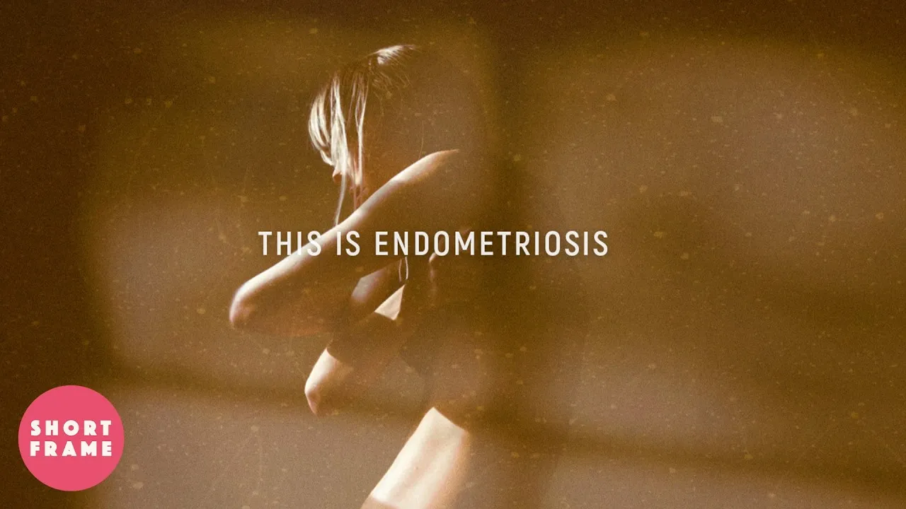

# Endo Adeno Resources Overview

> **Naming note:** This repository (`Awesome-Endo-Adeno-Resources`) is the source for the [1 in 7](https://1in7.info) website, published by Bloomed Health. Contributors should edit the content files in `content/` rather than the generated output in `dist/`.

*Welcome to your go-to resource for navigating the challenges of Endometriosis and Adenomyosis*. Diagnosis, symptom management, and treatment can be overwhelming, but it shouldn't be.

- [*Endometriosis*](https://en.wikipedia.org/wiki/Endometriosis): A chronic condition where tissue similar to the uterine lining grows outside the uterus, causing pain, heavy periods, and infertility.  
  [Approximately 10% of women and girls of reproductive age have Endometriosis](https://www.who.int/news-room/fact-sheets/detail/endometriosis) - around 190 million worldwide (WHO). In Australia, [the figure is estimated at 1 in 7](https://endometriosisaustralia.org/1-in-7-australian-women/), suggesting underdiagnosis globally.
- [*Adenomyosis*](https://en.wikipedia.org/wiki/Adenomyosis): A condition where endometrial tissue grows into the muscular wall of the uterus, leading to heavy menstrual bleeding, pain, and uterine enlargement.

**▶ This Is Endometriosis** - *BAFTA-winning documentary short film (2026) - Free to watch*

## Contents

<main id="main-content" role="main" aria-label="Main content">

**Diagnosis and Medical Care**

1. [Diagnosis](#diagnosis)
2. [Vetted Physician and Healthcare Providers](#vetted-physician-and-healthcare-providers)
3. [Diagnostic Tools and Platforms](#diagnostic-tools-and-platforms)
4. [Medical Data Tools, Trackers, and Managers](#medical-data-tools-trackers-and-managers)
5. [AI-Enabled Platforms and Ongoing Studies for Research](#ai-enabled-platforms-and-ongoing-studies-for-research)

**Treatment and Co-morbidities**

6. [Therapeutic Treatments](#therapeutic-treatments)
7. [Potential Co-morbidities](#potential-co-morbidities)

**Research and Clinical Guidelines**

8. [Medical Research](#medical-research)
9. [Clinical Guidelines](#clinical-guidelines)

**Life Stages and Reproductive Health**

10. [Fertility Resources](#fertility-resources)
11. [Pregnancy and Obstetric Complications](#pregnancy-and-obstetric-complications)
12. [Adolescent and Teen Resources](#adolescent-and-teen-resources)
13. [Endometriosis and Menopause](#endometriosis-and-menopause)
14. [Sexual Health and Intimacy](#sexual-health-and-intimacy)

**Symptom Management and Wellness**

15. [Pain Management Beyond Medication](#pain-management-beyond-medication)
16. [Exercise and Movement](#exercise-and-movement)
17. [Wearable Technology](#wearable-technology)
18. [Telehealth Platforms](#telehealth-platforms)

**Financial and Legal Support**

19. [Financial Assistance Platforms](#financial-assistance-platforms)
20. [Insurance Navigation](#insurance-navigation)
21. [Disability Benefits](#disability-benefits)
22. [Military and Veterans](#military-and-veterans)
23. [Workplace and Disability Advocacy](#workplace-and-disability-advocacy)

**Community and Advocacy**

24. [Advocacy Groups and Vetted Providers](#advocacy-groups-and-vetted-providers)
25. [Transgender and Non-Binary Endo Care](#transgender-and-non-binary-endo-care)
26. [Endometriosis and Race/Ethnicity Disparities](#endometriosis-and-raceethnicity-disparities)
27. [Regional Based Groups and Platforms](#regional-based-groups-and-platforms)
28. [Community Sourced Data and Support](#community-sourced-data-and-support)

**Education and Outreach**

29. [Educational Materials](#educational-materials)
30. [Partner and Caregiver Resources](#partner-and-caregiver-resources)
31. [Conferences and Summits](#conferences-and-summits)
32. [Government Policy and Legislation](#government-policy-and-legislation)
33. [Emerging Biotech](#emerging-biotech)
34. [Spanish-Language Resources](#spanish-language-resources)
35. [French-Language Resources](#french-language-resources)
36. [Portuguese-Language Resources](#portuguese-language-resources)
37. [Patient Registries and Research Participation](#patient-registries-and-research-participation)

This resource list is packed with expert advice, community support, and the latest medical research insights, all aimed at making your life a little easier. Whether you're newly diagnosed or have been living with these conditions for a while, my hope is to offer guidance and support.

## Diagnosis

- [Endometriosis](https://en.wikipedia.org/wiki/Endometriosis)
  - Current Methods:
    - Laparoscopy remains the gold standard for definitive diagnosis.
    - Imaging techniques like MRI and ultrasound are used but may miss early or atypical cases.
    - New non-invasive blood tests (e.g., [Ziwig Endo Test](https://ziwig.com/en/ziwig-endotest/); [PromarkerEndo](https://www.proteomics.com.au/)) have shown promise in detecting biomarkers associated with the disease. *Performance claims are manufacturer-reported; independent peer-reviewed validation is ongoing.*
  - Potential Indicators:
    - Presence of [Endometriomas](https://en.wikipedia.org/wiki/Endometrioma)
      - These are cysts filled with old blood. Endometriomas are a type of Endometriosis, but alternatively, Endometriosis does not mean that you have an Endometrioma.
- [Adenomyosis](https://en.wikipedia.org/wiki/Adenomyosis)
  - Current Methods:
    - Diagnosis is often based on symptoms, pelvic exams, and imaging (MRI or ultrasound).
    - Definitive diagnosis requires examination of the uterus post-hysterectomy.
  - Potential Indicators:
    - [Decidual Casts](https://ispub.com/IJGO/9/1/11420)
    - Excessive Bleeding during periods

### [Endometriosis Symptoms](https://www.ivf.com.au/blog/heres-the-four-stages-of-endometriosis)

<table role="table" aria-label="Endometriosis symptoms by stage and severity">
<caption>Endometriosis symptoms categorized by stage, severity, symptoms, and spread</caption>
<thead>
<tr>
<th scope="col">Stage/Type</th>
<th scope="col">Severity</th>
<th scope="col">Symptoms</th>
<th scope="col">Spread / Distribution</th>
</tr>
</thead>
<tbody>
<tr>
<td><strong>Stage I (Minimal)</strong></td>
<td>Mild</td>
<td>Mild or no pelvic pain; Possible infertility; Occasional dysmenorrhea</td>
<td>None</td>
</tr>
<tr>
<td><strong>Stage II (Mild)</strong></td>
<td>Mild to moderate</td>
<td>Moderate pelvic pain; Dysmenorrhea; Dyspareunia; Possible infertility</td>
<td>None</td>
</tr>
<tr>
<td><strong>Stage III (Moderate)</strong></td>
<td>Moderate</td>
<td>Chronic pelvic pain; Severe dysmenorrhea; Dyspareunia; Dyschezia; Infertility</td>
<td>Local spread</td>
</tr>
<tr>
<td><strong>Stage IV (Severe)</strong></td>
<td>Severe</td>
<td>Chronic, severe pelvic pain; Debilitating dysmenorrhea; Severe dyspareunia; Dyschezia; Dysuria; Infertility; Bowel/bladder dysfunction</td>
<td>Extensive local spread</td>
</tr>
<tr>
<td><strong>Deep Infiltrating (DIE)</strong></td>
<td>Very severe</td>
<td>All Stage IV symptoms plus: Intense chronic pelvic pain; Severe dyspareunia; Dyschezia, bowel obstruction possible; Dysuria, hydronephrosis possible; Organ dysfunction depending on affected areas (e.g., bowel, bladder, ureters)</td>
<td>Deep tissue involvement (bowel, bladder, ureters)</td>
</tr>
<tr>
<td><strong>Thoracic</strong></td>
<td>Very severe</td>
<td>Catamenial pneumothorax (lung collapse during menstruation); Hemoptysis (coughing up blood); Cyclic chest pain, shoulder pain, or dyspnea (shortness of breath); Hemothorax or pericardial effusion in severe cases</td>
<td>Distant sites such as the chest cavity</td>
</tr>
</tbody>
</table>

*rASRM staging describes anatomical extent (adhesions, implant size) - it does not correlate with pain severity. Stage I can cause debilitating symptoms and Stage IV can be asymptomatic.*

### [Adenomyosis Symptoms](https://asktia.com/article/adenomyosis-causes-symptoms-treatment/)

| Type/Stage   | Severity   | Symptoms   | Spread / Distribution   |
| ------------------- | --------------- | --------------- | --------------- |
| **Focal Adenomyosis**   | Mild to severe     | Localized uterine pain or tenderness; Heavy menstrual bleeding (menorrhagia); Dysmenorrhea (painful periods); Dyspareunia (painful intercourse); Pelvic pressure or fullness; Possible infertility   | Localized uterine involvement              |
| **Diffuse Adenomyosis** | Moderate to severe | Diffuse uterine pain or tenderness; Severe menorrhagia (heavy menstrual bleeding); Chronic pelvic pain; Dyspareunia; Significant uterine enlargement ("boggy" uterus); Anemia due to heavy bleeding; Infertility or miscarriage risk | Extensive uterine involvement              |
| **Stage 1: Early**      | Mild               | Minimal infiltration of endometrial tissue into the uterine wall; Symptoms often mild or non-existent             | None                                       |
| **Stage 2: Moderate**   | Moderate           | Increased infiltration of uterine wall tissue; Heavy and painful periods; Bloating and discomfort during intercourse   | None   |
| **Stage 3: Severe**     | Severe             | Severe infiltration leading to distortion of uterine shape; Escalating menstrual pain and flow intensity   | Possible localized spread                  |
| **Stage 4: Advanced**   | Very severe        | Extensive tissue infiltration causing significant uterine damage; Chronic pelvic pain, heavy bleeding, intermenstrual bleeding, and painful intercourse   | Potential damage to surrounding structures |

## Vetted Physician and Healthcare Providers

- [iCareBetter](https://icarebetter.com/)
  - Connecting as many Endo patients to the right [experts](https://icarebetter.com/endometriosis-specialist/) as early as possible
- [The Yellow Hub](https://www.theyellowhub.org/)
  - Empowering patient lives with compassionate tech
- [Roon](https://www.roon.com/)
  - Remote access to vetted medical experts
- [Hale](https://www.gethale.it/)
  - In-person and remote clinic to help those who suffer from Endometriosis, vulvodinia, and/or sexual pain. *In Italy*
- [Center for Endometriosis Care (CEC)](https://centerforendo.com/)
  - Pioneers in laparoscopic excision (LAPEX), specializing in the excisional approach to all Endometriosis including thoracic, bowel, and deep/complex disease. Offers free case reviews. *Atlanta, GA*
- [Nezhat Medical Center](https://endometriosisspecialists.com/)
  - Pioneered video-assisted laparoscopy; treats complex Endometriosis cases. *Atlanta, GA*
- [APTA Pelvic Health PT Locator](https://aptapelvichealth.org/ptlocator/)
  - Directory helping patients find licensed Physical Therapists who specialize in pelvic and abdominal health, with filters for Endometriosis expertise
- [Nancy's Nook Endometriosis Education](https://nancysnookendo.com/)
  - Founded by Nancy Petersen, RN; offers educational resources and a surgeon verification list. Note: not all surgeons on the list have the same skill level, experience, or treatment philosophies

## Diagnostic Tools and Platforms

- [Ziwig](https://ziwig.com/en/ziwig-endotest/)
  - A saliva test for Endometriosis providing a reliable diagnosis within just a few days. Reimbursed in France since 2024; NICE draft guidance (July 2026) recommends further evidence generation before NHS adoption
- [Qvin](https://qvin.com/)
  - Turn your monthly menstrual blood into lab reports and access personalized health data
- [Hertility Health](https://hertilityhealth.com/)
  - Provides comprehensive reproductive health testing and insights
- [Joii](https://joiicare.com/)
  - Advancing menstrual and gynaecological health research
- [Hera](https://www.herabiotech.com/)
  - Hera Biotech created a diagnostic tool, MetriDx™, designed to reduce the need for diagnostic laparoscopy. *Performance claims are manufacturer-reported; awaiting independent peer-reviewed validation.*
- [The Blood](https://www.theblood.io/)
  - The first menstrual blood fertility and menopause test
- [Afynia](https://afynia.com/)
  - Developing the first-ever microRNA-based molecular screen for Endometriosis, called EndomiR: EndomiR compares the expression levels of a panel of microRNAs with those from surgically confirmed cases of Endometriosis.
- [Diamens](https://www.eib.org/en/stories/diamens-at-home-test-endometriosis)
  - Diamens is still in the clinical development stage, but is working to develop an affordable at-home test to diagnose Endometriosis using menstrual blood
- [HerResolve by HerAnova Lifesciences](https://heranova.com/products/)
  - First commercially available blood test for Endometriosis (launched Dec 2025). AI-driven multi-omic test with 94.4% accuracy. Available at select US IVF centers
- [Kephera Diagnostics - EndomTest](https://kephera.com/)
  - First commercially available blood test for Endometriosis in the US (launched July 2025). Measures CA-125 and BDNF combined with clinical variables; published validation studies show 100% specificity
- [NextGen Jane](https://www.nextgenjane.com/)
  - Tampon-based diagnostic using RNA-seq analysis of menstrual blood to detect Endometriosis biomarkers. Building the world's largest menstrual blood biobank
- [EndoSure](https://www.endosure.com/)
  - CE-marked non-invasive diagnostic using electroviscerography (EVG) with external abdominal sensors; results in ~30-40 minutes, works across all disease stages including adolescents
- [Cedars-Sinai - When to Get a Second Opinion](https://www.cedars-sinai.org/blog/second-opinion.html)
  - Guidance from a leading academic medical center on when and how to seek a second opinion for complex conditions including Endometriosis
- [ESSI - Preparing for a Second Surgical Opinion](https://internationalendo.com/second-opinion-endometriosis-surgery/)
  - Practical guide on preparing for a second surgical opinion for Endometriosis, including what records to gather and questions to ask

## Medical Data Tools, Trackers, and Managers

- Genetic Data Testing
  - [Invitae](https://www.invitae.com/)
    - Whole genome sequencing
  - [EndoGenomics](https://www.endogenomics.com/)
    - Endometriosis genomics
- Genetic Data Storage
  - [GenomesDAO](https://genomes.io/)
    - Genomes.io provides a private and secure DNA data vault
  - [Nebula Genomics](https://nebula.org/)
    - Nebula Genomics offers secure storage and analysis of whole genome sequencing data
- Trackers & Data Managers
  - [LasaHealth](https://www.lasahealth.com/)
    - Uses electronic health records to identify undiagnosed chronic pelvic pain patients using AI/machine learning algorithms
  - [Clue](https://helloclue.com/articles/cycle-a-z/how-to-track-endometriosis-symptoms-with-clue)
    - Endometriosis symptom tracker
  - [HerMaid](https://www.hermaid.me/en/frauengesundheit)
    - Women's Health management platform for symptom management, tracking, and recommendations
  - [NoEndo](https://www.noendo.fr/#/)
    - NoEndo is a French platform designed to help individuals affected by Endometriosis
  - [Bearable](https://bearable.app/)
    - Symptom tracker and correlation engine identified as one of six "good quality" mHealth apps for Endometriosis (JMIR 2025 review). Unique feature shows impact of activities on symptoms, mood, sleep, and energy
  - [Good-Quality mHealth Apps for Endometriosis Care: Systematic Search](https://www.jmir.org/2025/1/e49654) (JMIR, 2025)
    - Systematic review evaluating 42 apps using the ENLIGHT validated assessment tool, identifying six recommended apps for Endometriosis care

## AI-Enabled Platforms and Ongoing Studies for Research

- [Scanvio](https://www.scanvio.com/)
  - Faster Endometriosis diagnosis with our AI-augmented ultrasound software
- [IMAGEENDO](https://imagendo.org.au/about/)
  - Reducing the diagnostic delay of Endometriosis through imaging
- [FEMaLe](https://findingendometriosis.eu/inovation/ai/)
  - The FEMaLe project will bring the revolution with the application of Augmented Reality (AR) in dealing with Endometriosis
- [Endometriosis Subtyping study by @guarelin](https://github.com/Setia-Verma-Lab/endometriosis_subtyping)
  - Enhancing genetic association power in Endometriosis through unsupervised clustering of clinical subtypes identified from electronic health records
- [EndoRISE (The Jackson Laboratory / UConn Health)](https://ctendorise.org/researchers)
  - First state-supported multi-institutional Endometriosis program with 2,000+ biospecimen biorepository using single-cell sequencing and spatial omics
- [Endo Lab - Research Portal](https://endolab.net/research/)
  - Curated research corpus aggregating 386,000+ Endometriosis and adenomyosis papers from PubMed, OpenAlex, ClinicalTrials.gov, ICTRP, and NIH RePORTER. Offers hybrid/keyword/semantic search modes, study-type filters, and one-click citation export

## Therapeutic Treatments

  
Click to expand Treatment Options

### Surgical Treatments

#### Endometriosis Treatments

- It is critical to note: Hysterecomy DOES NOT treat Endometriosis, only Adenomyosis

| Technique | Key Advantage | Provider Network |
|-----------|---------------|------------------|
| **Laparoscopic Excision Surgery** | Gold standard for Endometriosis treatment; removes lesions while preserving healthy tissue | Various specialized centers worldwide |
| **Nerve-Sparing Excision** | Preserves pelvic nerve plexus to reduce post-op chronic pain | Mayo Clinic; UCSF; EEL Centers |
| **Presacral Neurectomy** | Cuts nerves to uterus to relieve severe pelvic pain | Various specialized centers |
| **Lysis of Adhesions** | Removes scar tissue that can cause pain and infertility | Various specialized centers |
| **Resection of Deep Infiltrating Endometriosis (DIE)** | Targets removal of deeply infiltrating lesions affecting bowel, bladder, ureters | Various specialized centers |
| **Robotic-Assisted DIE Resection** | Enhanced precision for rectovaginal and bladder lesions | Memorial Sloan Kettering; Johns Hopkins |
| **Robotic-Assisted Surgery** | Enhanced precision and control for complex cases | Various specialized centers |

#### [Adenomyosis Treatments](https://asktia.com/article/adenomyosis-causes-symptoms-treatment/)

| Technique | Key Advantage | Provider Network |
|-----------|---------------|------------------|
| **Hysterectomy** | Surgical removal of uterus for severe cases not responding to other treatments | Various specialized centers |
| **Uterine Artery Embolization (UAE)** | Minimally invasive; blocks blood supply to affected areas; [92.3% improvement rate, 82% avoid hysterectomy long term](https://blog.nbir.com.au/alternative-to-hysterectomy-for-adenoymosis) | Various specialized centers |
| **Focal Adenomyoma Excision** | Conservative uterine-sparing removal | Centre for Reproductive Medicine (The Netherlands) |
| **Radiofrequency Ablation** | [68.1% pain reduction and fertility preservation potential](https://pmc.ncbi.nlm.nih.gov/articles/PMC8348135/) | Various specialized centers |
| **High-Intensity Focused Ultrasound (HIFU)** | [Non-surgical option using ultrasound waves for coagulative necrosis](https://pmc.ncbi.nlm.nih.gov/articles/PMC8348135/) | Various specialized centers |
| **Myomectomy** | Surgical removal of fibroids while preserving fertility | Various specialized centers |

### Non-Surgical Treatments

- Latest Advancements in Non-Surgical Diagnostics & Therapeutics for Endometriosis

| Method        | Key Features                                   | Advantages                                    | Limitations                               |
|--------------------------|-----------------------------------------------|-------------------------------------|-------------------------------------------|
| [PromarkerEndo](https://www.proteomics.com.au/) (Blood Test)| Identifies protein biomarkers  | Cost-effective, early-stage detection        | Requires further validation for global use |
| Electroviscerography (EVG)| Monitors gastrointestinal myoelectric activity| Non-invasive, experimental                   | Needs more clinical trials                |
| EVG-Guided Pelvic Floor Biofeedback | Uses EVG monitoring for targeted pelvic floor therapy | Personalized pelvic floor rehabilitation | Requires specialized equipment and training |
| Infrared Spectroscopy    | Spectrochemical analysis                      | Highly sensitive, non-invasive               | Early research stage                      |
| Imaging Innovations      | Advanced imaging technologies                 | Reliable alternative to surgery              | Clinical trials ongoing                   |
| [AI + Omics Integration](https://pubmed.ncbi.nlm.nih.gov/39926583/)   | Combines AI and molecular data                | Personalized diagnostics                     | Requires large-scale validation           |
| [Microbiome modulation](https://www.sciencedirect.com/science/article/pii/S1471491424001667)    | Gut–microbiota–brain axis recently emerged as a key player in neuro-pain pathways                | Personalized treatment                     | Needs More Developed Research           |

### Medicinal Treatments

  
Click to expand Medicinal Treatments

 As stated from [EndoWhat?](https://www.youtube.com/c/endowhat), "All medications aimed at "treating" Endometriosis only manage symptoms. They do not treat the disease itself. Drug therapy can suppress Endometriosis, not eradicate it."

#### Medication and Medicinal Supplements

- [Immunology and Immunotherapy of Endometriosis](https://pmc.ncbi.nlm.nih.gov/articles/PMC8708975/)
  - Research on the treatment of Endometriosis symptoms with Low Dose Naltrexone
- [Tolerability and Shared Decision-Making in Hormonal Management of Endometriosis](https://pmc.ncbi.nlm.nih.gov/articles/PMC12467333/) (Biomedicines, 2025)
  - Narrative review comparing GnRH analogues, dienogest, and gestrinone for Endometriosis pain, focusing on long-term tolerability and patient-centered shared decision-making

#### Cannabis and Herbal

- [Lara Parker's Journey with Endometriosis](https://www.forbes.com/sites/javierhasse/2019/12/04/lara-parker/#16937b1561e2)
  - "Lara Parker shares her personal experience with Endometriosis and discusses various non-surgical treatment options."
- [Cannabis and Endometriosis: A Survey of Its Effectiveness](https://journals.plos.org/plosone/article?id=10.1371/journal.pone.0258940)
  - "This study explores the effectiveness of cannabis in managing Endometriosis symptoms, providing valuable insights into its potential benefits."
- [Cannabinoids Improve Symptoms in Mice with Endometriosis](https://elifesciences.org/for-the-press/84e17c36/cannabinoids-improve-symptoms-in-mice-with-endometriosis)
  - "This research highlights the potential of cannabinoids in alleviating Endometriosis symptoms in a mouse model."

#### Physical Therapy

- [Pelvic Health Physiotherapy: A Guide for People With Endometriosis](https://endometriosisnetwork.com/endo-hub/pelvic-health-physiotherapy-a-guide-for-people-with-endometriosis/)
  - Pelvic health physiotherapy is an effective, evidence‑based treatment for some symptoms of Endometriosis, like pain with sexual activity. It's also helpful for treating other conditions and diseases that many people with Endometriosis have, either independently or as a result of Endometriosis.
- [Herman & Wallace Pelvic Rehabilitation Institute](https://hermanwallace.com/)
  - Provider directory for pelvic floor specialists trained in Endometriosis treatment
- [Pelvic Rehabilitation Medicine - Excision Surgery Resources](https://pelvicrehabilitation.com/resources/excision-surgery-resources/)
  - Patient resource hub covering pre-habilitation, surgery prep, post-operative rehab, questions to ask your surgeon, and lifetime management plans for excision surgery
- [Physical Rehabilitation for Endometriosis & Adenomyosis: Systematic Review](https://pmc.ncbi.nlm.nih.gov/articles/PMC12692515/) (2025)
  - Meta-analysis of 17 trials finding consistent improvements in pain, quality of life, and mental health across rehabilitation modalities
- [Hinge Health Pelvic Health Program](https://www.hingehealth.com/for-individuals/pelvic-health/)
  - Digital pelvic floor physical therapy program with specialized care teams; average 67% reduction in pelvic pain within 12 weeks; covers Endometriosis pre/post-surgery rehab
- [Exercise and Endometriosis: Systematic Review & Meta-Analysis](https://journals.plos.org/plosone/article?id=10.1371/journal.pone.0317820) (PLOS ONE, 2025)
  - Meta-analysis of 6 RCTs showing significant pain reduction (P<0.0001) and quality of life improvement from structured exercise
- [GLOWM Physiotherapy for Endometriosis](https://www.glowm.com/article/heading/vol-3--endometriosis--physiotherapy-for-endometriosis/id/418263)
  - Professional-level chapter covering pain science mechanisms, evidence-based physiotherapy approaches, clinical assessment, and case studies; offers CPD points for allied health professionals

#### Mental Health Support

- [Endometriosis Network Canada Mental Health Guide](https://endometriosisnetwork.com/)
  - Comprehensive guidance on therapy types (CBT, ACT, mindfulness) and crisis resources including 988 for immediate assistance
- Pain Psychology Specialists
  - Pain-informed therapists can help process medical trauma and arm patients with resources for navigating the medical system assertively. Look for therapists specializing in chronic pain management.
- [Medical Trauma Support - Endometriosis and Medical Trauma](https://www.medicaltraumasupport.org/blog/endometriosis-and-medical-trauma-when-the-system-that-should-help-you-causes-harm)
  - Peer support community grounded in somatic and nervous system practices specifically for people dismissed by the healthcare system; addresses medical gaslighting and diagnostic trauma
- ["Belittled" and "Broken": Distressing Medical Interactions in Endometriosis Healthcare](https://www.tandfonline.com/doi/full/10.1080/23293691.2025.2602849) (2026)
  - Mixed methods study of 468 people finding 80.8% reported distressing medical interactions; 64.1% experienced harmful communication (being disbelieved, belittled, blamed)
- ["Endo Belly": Body Image, Disordered Eating, and Psychopathology in Endometriosis](https://pmc.ncbi.nlm.nih.gov/articles/PMC12050103/) (2025)
  - Mixed methods study exploring how "endo belly" bloating drives body image dissatisfaction and disordered eating patterns; calls for targeted eating disorder prevention
- [Endometriosis and Eating Disorders: Epidemiology, Shared Neurobiology, and Clinical Implications](https://pmc.ncbi.nlm.nih.gov/articles/PMC12823736/) (2026)
  - Review examining the epidemiological coexistence of Endometriosis and eating disorders, shared neuroimmune/neuroendocrine alterations, and psychosocial vulnerabilities
- [Pausefully - Endometriosis Infertility Counselling](https://pausefully.co.uk/endometriosis-infertility-counselling/)
  - Specialized counselling for the grief, loss, and emotional impact of Endometriosis-related infertility
- [Phoenix Health - Endometriosis Mental Health, Pain, and Grief](https://phoenixhealth.co.uk/endometriosis-mental-health/)
  - Integrated mental health support addressing chronic pain psychology, grief from fertility loss, and the emotional toll of living with Endometriosis
- [The Chronic Illness Therapist Podcast](https://www.thechronicillnesstherapist.com/podcast)
  - Podcast by a therapist living with chronic illness, covering grief, medical trauma, pain acceptance, and mental health strategies relevant to Endometriosis patients

#### Complementary and Alternative Therapies

- [Acupuncture and Related Therapies for Endometriosis: Network Meta-Analysis](https://pmc.ncbi.nlm.nih.gov/articles/PMC11456303/) (2024)
  - Network meta-analysis of 42 RCTs (3,635 participants) comparing six acupuncture-related interventions; combination therapy superior to western medicine alone for pain
- [Complementary Therapies for Endometriosis: Extensive Survey](https://www.sciencedirect.com/science/article/pii/S2949838425000210) (2025)
  - Survey of 780 patients finding 86% use non-pharmacological therapies; over half reported reducing conventional analgesic intake due to complementary treatments
- [Holistic Approaches in Endometriosis: Systematic Review](https://pmc.ncbi.nlm.nih.gov/articles/PMC11527925/) (2024)
  - Systematic review covering manual therapy, physical activity, nutrition, acupuncture, TCM, and TENS as adjuncts to medical/surgical Endometriosis treatment
- [Brigham and Women's Hospital - Complementary and Alternative Therapies for Endometriosis](https://www.brighamandwomens.org/obgyn/infertility-reproductive-surgery/endometriosis/complimentary-and-alternative-therapies-for-endometriosis)
  - Hospital-based clinical guide covering acupuncture, physical therapy, biofeedback, and lifestyle modifications within a multidisciplinary team framework

#### Surgical Recovery

- [EndoFound - Surgery Preparation Checklist](https://www.endofound.org/checklist-tips-to-prepare-for-endometriosis-surgery)
  - Pre-op checklist covering medications, timeline, and caregiver coordination
- [Endo Excision for All - Excision Surgery Prep/Recovery](https://endoexcisionforall.org/patient-resources/how-to-prepare-for-endometriosis-excision-surgery)
  - Excision-specific prep and recovery checklist
- [ESSI - Holistic Guide to Endo Surgery Recovery](https://internationalendo.com/holistic-recovery-endometriosis-surgery/)
  - Physical healing timeline, nutrition, movement reintroduction, and emotional recovery guidance
- [iCareBetter - Comprehensive Guide to Endometriosis Surgery Aftercare](https://icarebetter.com/endometriosis/education/endometriosis-surgery/navigating-the-road-to-recovery-a-comprehensive-guide-to-endometriosis-surgery-aftercare/)
  - Detailed recovery guide covering wound care, pain medication management, scar care with silicone sheets and vitamin E, dietary recovery, and mobility progression
- [MOVENDOP Protocol - Early Mobilization After Endometriosis Surgery](https://pmc.ncbi.nlm.nih.gov/articles/PMC11834261/) (PMC, 2025)
  - Evidence-based protocol for early postoperative mobilization following deep Endometriosis surgery, with structured recovery milestones
- [Adhesion Prevention After Endometriosis Surgery: Patient Guide](https://www.endofound.org/adhesion-prevention-after-surgery)
  - Patient-facing guide on understanding post-surgical adhesion formation, prevention strategies, and when to seek care for adhesion-related symptoms

#### Nutrition & Anti-Inflammatory Resources

- [BC Women's Centre for Pelvic Pain & Endometriosis - Diet Recommendations](https://bcwomens.ca/)
  - Comprehensive anti-inflammatory dietary recommendations for chronic pelvic pain and Endometriosis
- Key evidence-based dietary findings:
  - Reducing dietary fat and increasing dietary fiber have been shown to reduce circulating estrogen concentrations
  - Anti-inflammatory properties of plant-based diets may benefit those with Endometriosis
  - A diet filled with antioxidants, PUFAs, vitamins D, C and E while avoiding processed foods, red meat, and animal fats may help
- Recent evidence-based diet studies:
  - [Diet and Endometriosis: Umbrella Review](https://pmc.ncbi.nlm.nih.gov/articles/PMC12192176/) (2025) - Synthesizes all existing systematic reviews; vegetables and dairy mildly protective, butter and high caffeine (>300mg/day) increase risk
  - [Mediterranean Diet and Endometriosis](https://www.nature.com/articles/s41598-025-20621-6) (Nature Scientific Reports, 2025) - Mediterranean diet adherence associated with significantly decreased odds of Endometriosis
  - [Nutrition and Endometriosis: Evidence, Limits and Clinical Perspectives](https://pubmed.ncbi.nlm.nih.gov/41628666/) (2026) - Mediterranean and DASH diets offer best indirect benefits; warns against unnecessary restrictive diets that risk nutritional deficiencies
  - [Monash Low-FODMAP Diet for Endometriosis RCT](https://www.monash.edu/news/articles/low-fodmap-diet-can-ease-symptoms-of-those-with-endometriosis-study) (2025) - Landmark RCT: 60% responded to low-FODMAP diet vs. 26% control, 40% lower GI symptom severity
  - [EndoFOD Trial](https://onlinelibrary.wiley.com/doi/full/10.1111/apt.70161) (Alimentary Pharmacology & Therapeutics, 2025) - Full peer-reviewed paper from the Monash low-FODMAP RCT
- [Monash FODMAP Dietitian Directory](https://www.monashfodmap.com/online-training/fodmap-dietitians-directory/)
  - Directory of certified FODMAP-trained dietitians for gut-related Endometriosis symptoms
- [Pelvic Rehab Medicine - Free Endo Anti-Inflammatory Cookbook](https://pelvicrehabilitation.com/resources/endo-cookbook/)
  - Free downloadable community-created cookbook for Endometriosis and chronic pelvic pain
- [Cleveland Clinic - Understanding the Endometriosis-Digestive Link](https://consultqd.clevelandclinic.org/understanding-the-endometriosis-digestive-link)
  - Clinician-facing guide on the Endometriosis-GI connection (up to 90% of endo patients have GI symptoms); covers prostaglandin-driven mechanisms, microbiota-gut-brain axis, and why gastroenterologists need to screen for Endometriosis
- [Heal Endo - Iron Deficiency and Endometriosis](https://www.healendo.com/iron-deficiency-endometriosis/)
  - Patient guide on the connection between iron deficiency and Endometriosis, covering symptoms, testing, dietary sources, and supplementation strategies

  
Click to expand Scientific Research and Findings

### Endometriosis

- [Endometriosis Typology and Ovarian Cancer Risk](https://jamanetwork.com/journals/jama/article-abstract/2821194)
  - "Those with Endometriosis had 4.2-fold higher ovarian cancer risk than those without Endometriosis. Those with ovarian [endometriomas](https://en.wikipedia.org/wiki/Endometrioma) and/or deep infiltrating Endometriosis, compared with no Endometriosis, had 9.7-fold higher risk"
- [Endometriosis and the risk of ovarian cancer: a meta-analysis](https://pubmed.ncbi.nlm.nih.gov/36988819/)
  - "The pooled odds ratio for Endometriosis and ovarian cancer was 4.2 (95% CI, 3.2 to 5.5)"
- [Novel Biomarkers for Endometriosis Diagnosis](https://www.ncbi.nlm.nih.gov/pmc/articles/PMC7891234/)
  - "Recent studies have identified several potential biomarkers, including microRNAs and cytokines, that could improve the accuracy of Endometriosis diagnosis."
- [Endometriosis Association with Gut Health and Inflammation](https://www.frontiersin.org/journals/reproductive-health/articles/10.3389/frph.2022.963752/full)
  - "This article explores the link between Endometriosis, gut health, and inflammation, suggesting that gut microbiota may play a role in the pathogenesis of Endometriosis and its associated symptoms."
- [Endometriosis: Pathophysiology and Management](https://www.mdpi.com/2227-9059/12/4/888)
  - "This study provides an overview of the pathophysiology of Endometriosis and discusses current management strategies, emphasizing the importance of personalized treatment approaches."
- [Multi-ancestry GWAS of endometriosis in ~1.4 million women](https://www.nature.com/articles/s41588-026-02582-2) (Nature Genetics, 2026)
  - Largest genome-wide association study of Endometriosis to date, identifying novel genetic risk loci across diverse ancestries
- [Endometriosis and comorbidities: molecular mechanisms](https://www.cell.com/trends/molecular-medicine/fulltext/S1471-4914(25)00211-4) (Trends in Molecular Medicine, 2025)
  - Review of molecular pathways linking Endometriosis to its systemic comorbidities
- [Endometriosis and autoimmunity: large-scale case-control study](https://pmc.ncbi.nlm.nih.gov/articles/PMC12176652/) (PMC, 2025)
  - Large-scale case-control study examining the association between Endometriosis and autoimmune conditions
- [Non-Invasive Diagnostic Methods review](https://pmc.ncbi.nlm.nih.gov/articles/PMC12732459/) (PMC, 2025)
  - Comprehensive review of emerging non-invasive diagnostic approaches for Endometriosis
- [Plasma protein biomarkers for endometriosis](https://academic.oup.com/humrep/advance-article-pdf/doi/10.1093/humrep/deae278/61272528/deae278.pdf) (Human Reproduction, 2024)
  - Identification of plasma protein biomarkers with potential for non-invasive Endometriosis diagnosis
- [Dichloroacetate for endo pain - EPiC1](https://www.thelancet.com/journals/lanogw/article/PIIS3050-5038(25)00028-7/fulltext) (The Lancet, 2025)
  - Phase 1 trial of repurposed cancer drug dichloroacetate for Endometriosis-related pain
- [SOSURE excision complications across 1,116 procedures](https://www.ncbi.nlm.nih.gov/pmc/articles/PMC11569428/) (PMC, 2024)
  - Safety outcomes of specialist excision surgery across over 1,000 procedures
- [Robotic multidisciplinary excision surgery](https://www.ncbi.nlm.nih.gov/pmc/articles/PMC12227863/) (PMC, 2025)
  - Outcomes of robotic-assisted multidisciplinary excision for deep Endometriosis
- [Non-Hormonal Therapeutic Strategies review](https://pmc.ncbi.nlm.nih.gov/articles/PMC12295211/) (PMC, 2025)
  - Review of non-hormonal therapeutic strategies for Endometriosis management
- [Endometriosis and Cardiovascular Disease: Systematic Review & Meta-Analysis](https://obgyn.onlinelibrary.wiley.com/doi/10.1111/aogs.70104) (AOGS, 2026)
  - Meta-analysis finding women with Endometriosis have increased risk of cerebrovascular disease (HR 1.19), ischemic heart disease (HR 1.35), and arrhythmias (HR 1.21)
- [Endometriosis and CVD Risk: Mendelian Randomization](https://www.tandfonline.com/doi/full/10.1080/03630242.2025.2539819) (2025)
  - Genetic-level evidence for causal links between Endometriosis and cardiovascular/cerebrovascular disease
- ["Endometriosis Brain" - Neurobiological Signatures](https://www.biorxiv.org/content/10.64898/2026.01.05.696004v1) (bioRxiv, 2026)
  - Comprehensive investigation of pain, cognition, and brain morphology changes including altered gray matter volume and functional connectivity in Endometriosis
- [Neuropsychiatric and Cognitive Manifestations of the "Endometriosis Brain"](https://www.researchgate.net/publication/397100821) (2025)
  - Review finding 80% of participants showed cognitive impairments; synthesizes evidence on brain fog, neuroinflammation, and central sensitization
- [Malignant Transformation of Endometriosis: Systematic Review](https://pmc.ncbi.nlm.nih.gov/articles/PMC12072307/) (2025)
  - Systematic review of genetic/molecular mechanisms of malignant transformation; risk is 0.5-1%, primarily clear cell and endometrioid ovarian cancers
- [From Inflammation to Malignancy: Endometriosis and Gynecological Cancers](https://pmc.ncbi.nlm.nih.gov/articles/PMC12733138/) (2026)
  - Review of inflammatory pathways linking Endometriosis to gynecological cancers including breast and endometrial malignancies
- [Impact of Endocrine Disruptors on Endometriosis](https://www.mdpi.com/1422-0067/26/15/7600) (IJMS, 2025)
  - Review of BPA, phthalates, dioxins, and heavy metals linked to Endometriosis development
- [Pollutants and Genetic Regulatory Variants in Endometriosis](https://www.nature.com/articles/s41431-025-01977-9) (Nature EJHG, 2025)
  - Gene-environment interaction analysis for Endometriosis development
- [Endo, Pregnancy Complications and Infertility](https://journals.sagepub.com/doi/10.1177/22840265251386969) (Sage, 2025)
  - Review linking Endometriosis to placenta previa, preterm birth, preeclampsia, and cesarean delivery
- [Impact of Endometriosis on Pregnancy/Obstetric Outcomes](https://journal.formosapublisher.org/index.php/ijar/article/view/16842) (2026)
  - PRISMA systematic review confirming Endometriosis as risk factor for multiple obstetric complications
- [Disparities in Racial Representation in FDA-Approved Endo Trials](https://obgyn.onlinelibrary.wiley.com/doi/10.1111/1471-0528.18305) (BJOG, 2025)
  - Only 4 of 9 FDA trials reported race; significant representation gaps in clinical research
- [Race/Ethnicity Reporting in Endometriosis Literature: Systematic Review](https://fvvo.eu/articles/race-and-ethnicity-reporting-in-endometriosis-literature-a-systematic-review/doi/FVVO.2025.153) (FVVO, 2025)
  - Only 10% of 648 studies reported race/ethnicity data
- [SSDI/SSI Claims Analysis for Endometriosis](https://www.whijournal.com/article/S1049-3867(23)00209-8/fulltext) (Women's Health Issues, 2023)
  - Research showing Endometriosis disability claims are systematically disadvantaged
- [Prevalence of Temporomandibular Disorders in Adult Women with Endometriosis](https://www.mdpi.com/2077-0383/13/24/7615) (JCM, 2024)
  - Cross-sectional study finding 77.3% of women with Endometriosis showed TMD symptoms; proposes endo and TMD as phenotypes of the same chronic overlapping pain condition
- [Association between Periodontitis and Endometriosis: Bidirectional Mendelian Randomization](https://www.frontiersin.org/journals/endocrinology/articles/10.3389/fendo.2024.1271351/full) (Frontiers in Endocrinology, 2024)
  - Mendelian randomization finding periodontitis positively associated with pelvic peritoneal Endometriosis (OR = 1.079) via shared inflammatory pathways
- [Prevalence of Sleep Disturbances in Endometriosis: Systematic Review and Meta-Analysis](https://www.frontiersin.org/journals/psychiatry/articles/10.3389/fpsyt.2024.1405320/full) (Frontiers in Psychiatry, 2024)
  - Meta-analysis of 16 studies (2,573 participants) finding 70.8% prevalence of sleep disturbances in Endometriosis patients
- [Sleep Disorders and Hyperarousal Among Patients with Endometriosis](https://www.ejog.org/article/S0301-2115(24)00386-5/fulltext) (EJOG, 2024)
  - Case-control study identifying hyperarousal as a partial mediator in the association between Endometriosis and sleep disorders
- [Long COVID and Endometriosis: Systematic Review and Meta-Analysis](https://link.springer.com/article/10.1186/s12905-025-03761-9) (BMC Women's Health, 2025)
  - Meta-analysis of 216,000+ participants finding Endometriosis linked to higher odds of long COVID via shared immune dysregulation
- [Long-COVID Syndrome in Patients with Endometriosis or Adenomyosis](https://doi.org/10.3390/jcm14061835) (JCM, 2024)
  - Cohort study evaluating long COVID syndrome specifically in patients with Endometriosis and adenomyosis
- [Endometriosis and Myalgic Encephalomyelitis/Chronic Fatigue Syndrome: Meta-Analysis](https://pmc.ncbi.nlm.nih.gov/articles/PMC12468137/) (PMC, 2025)
  - Meta-analysis of 13 studies finding 2.79-fold higher odds of ME/CFS in women with Endometriosis; identifies shared immune dysregulation and mitochondrial dysfunction
- [Effect of Medical Therapies for Endometriosis on Bone Health: Meta-Analysis](https://journals.lww.com/greenjournal/abstract/10.1097/aog.0000000000006241~effect-of-medical-therapies-for-endometriosis-on-bone-health) (Obstetrics & Gynecology, 2025)
  - Meta-analysis of 37 studies (28 RCTs) examining hormonal Endometriosis treatments on bone mineral density; found measurable BMD loss across all hormonal classes after 12 months
- [Global Landscape of Clinical Trials for Endometriosis](https://pmc.ncbi.nlm.nih.gov/articles/PMC12527674/) (PMC, 2025)
  - Analysis of 744 interventional pharmaceutical clinical trials identifying therapeutic trends, regional disparities, and unmet needs in non-hormonal drug development
- [Endometriosis Support and Digital Technology-Based Interventions: Systematic Review](https://humanfactors.jmir.org/2025/1/e71859) (JMIR Human Factors, 2025)
  - Systematic review examining how digital health interventions for Endometriosis have been developed, designed, and evaluated
- [Diagnostic Delay in Endometriosis: Updated Analysis](https://doi.org/10.1111/1471-0528.17995) (BJOG, 2024)
  - De Corte et al. analysis of diagnostic delay trends across healthcare systems, identifying persistent gaps despite increased awareness
- [Factors Contributing to Diagnostic Delay in Endometriosis: Systematic Review](https://doi.org/10.3389/fmed.2025.1504835) (Frontiers in Medicine, 2025)
  - Li et al. systematic review identifying patient-level, clinician-level, and system-level factors contributing to delayed Endometriosis diagnosis
- [Diagnostic Delay in the ComPaRe Endometriosis e-Cohort](https://doi.org/10.1016/j.ejogrb.2026.02.012) (EJOG, 2026)
  - Breton et al. longitudinal e-cohort study measuring real-world diagnostic delay and identifying modifiable factors for earlier detection
- [Social-Ecological Framework for Endometriosis Diagnostic Delay](https://doi.org/10.1016/j.socscimed.2024.116893) (Social Science & Medicine, 2024)
  - Boujenah et al. study applying a social-ecological model to understand how individual, interpersonal, institutional, and societal factors interact to delay Endometriosis diagnosis
- [Economic Burden of Endometriosis: $119 Billion per Year](https://www.nature.com/articles/s44294-025-00056-w) (npj Women's Health, 2025)
  - Analysis estimating the total annual economic burden of Endometriosis in the United States at $119 billion, including direct healthcare costs, lost productivity, and reduced quality of life
- [Cost of Illness in Endometriosis: EUR 9,579 per Patient](https://doi.org/10.1016/j.ajhr.2025.100312) (Asian Journal of Health Research, 2025)
  - Systematic review estimating annual per-patient costs of Endometriosis across healthcare systems, highlighting the substantial economic impact on patients and health systems
- [Iron Deficiency Prevalence in Endometriosis: 53.4%](https://doi.org/10.1002/ijgo.16168) (IJGO, 2025)
  - Goldberg et al. cross-sectional study finding 53.4% prevalence of iron deficiency among women with Endometriosis, significantly higher than the general population
- [Endometriosis and 46% Higher Risk of Iron Deficiency](https://doi.org/10.1016/j.ajog.2024.08.042) (AJOG, 2024)
  - Gete et al. Women's Health Initiative analysis finding women with Endometriosis have 46% higher odds of iron deficiency, independent of menstrual blood loss
- [GnRH Antagonist Comparative Meta-Analysis](https://pmc.ncbi.nlm.nih.gov/articles/PMC11795291/) (PMC, 2025)
  - Meta-analysis comparing oral GnRH antagonists (elagolix, relugolix, linzagolix) for Endometriosis-associated pain, evaluating efficacy, bone density effects, and tolerability profiles

### Adenomyosis

- [Gonadotropin-releasing hormone antagonist in uterine adenomyosis](https://www.fertstert.org/article/S0015-0282(25)00518-7/fulltext)
  - "Oral gonadotropin-releasing hormone (GnRH) antagonists appear to offer a promising new potential treatment alternative, allowing dose-dependent control of estradiol levels with rapid reversibility and no flare-up effect."
- [Emerging Therapies for Adenomyosis Management](https://www.tandfonline.com/doi/full/10.1080/13625187.2021.1901234)
  - "New therapeutic approaches, including the use of GnRH antagonists and uterine artery embolization, are showing promise in the management of adenomyosis symptoms."
- [Systemic comorbidities in patients with adenomyosis](https://www.sciencedirect.com/science/article/pii/S1472648325003098)
  - "A prospective observational study compared the presence of comorbidities between patients with adenomyosis (n=342) and those with both adenomyosis and Endometriosis (n=347)."
- [Global prevalence of adenomyosis and endometriosis](https://rbej.biomedcentral.com/articles/10.1186/s12958-025-01483-z) (2025)
  - Meta-analysis of 198.9 million women across 127 studies establishing global prevalence data
- [Adenomyosis: underacknowledged cause of AUB and pelvic pain](https://www.ncbi.nlm.nih.gov/pmc/articles/PMC11959650/) (PMC, 2025)
  - Review highlighting adenomyosis as an underrecognized cause of abnormal uterine bleeding and chronic pelvic pain
- [Conservative surgical treatment for adenomyosis](https://www.sciencedirect.com/science/article/pii/S1521693424000531) (ScienceDirect, 2024)
  - Evidence review of uterine-sparing surgical approaches for adenomyosis
- [Advances in Non-Invasive Diagnosis of Adenomyosis: Narrative Review](https://gpm.amegroups.org/article/view/10643/html) (2025)
  - Reports TVUS sensitivity 78.5%/specificity 70.7% and MRI sensitivity 64.8%/specificity 87.5%; covers updated MUSA criteria and 3D imaging improvements
- [Navigating Complexity: Endometriosis and Adenomyosis Imaging Review](https://pmc.ncbi.nlm.nih.gov/articles/PMC13070643/) (PMC, 2025)
  - Comprehensive review and update on imaging techniques for both Endometriosis and adenomyosis
- [MRI-Guided Focused Ultrasound for Adenomyosis](https://www.frontiersin.org/journals/medicine/articles/10.3389/fmed.2026.1794748/full) (Frontiers, 2026)
  - Open-access review of current evidence and future directions for MRI-guided focused ultrasound as a uterus-preserving treatment for adenomyosis
- [Adenomyosis/Endometriosis and Adverse Pregnancy Outcomes - Mendelian Randomization](https://pmc.ncbi.nlm.nih.gov/articles/PMC12998892/) (PMC, 2026)
  - Genetic evidence that Endometriosis and adenomyosis may be risk factors for recurrent miscarriage

## Potential Co-morbidities

### Data Source

De-identified EHRs using OMOP Common Data Model

### Research Foundation

  
Click to expand Key Findings

- **661 significantly enriched conditions** identified at UCSF
- **302 conditions replicated** across independent datasets (45% validation rate)
- **Strong correlation strength:** Pearson r = 0.864 between datasets
- **Patient clustering** reveals distinct subgroups requiring personalized treatment approaches

### Comorbidity Categories

  
Click to expand Comorbidity Categories

#### Gynecological Conditions (Strongest Associations)

| Comorbidity                                      | Prevalence in Endometriosis | Prevalence in Adenomyosis | Likelihood Rate                           | Population Percentage | Notes                                             |
| ------------------------------------------------ | --------------------------- | ------------------------- | ----------------------------------------- | --------------------- | ------------------------------------------------- |
| [**Uterine adenomyosis**](https://www.sciencedirect.com/science/article/pii/S2666379125003180)                          | **80.6%**                   | -                         | **Very High**                             | **80.6%**             | **OR = 181 (strongest association identified)**  |
| [**Pelvic peritoneal adhesions**](https://www.sciencedirect.com/science/article/pii/S2666379125003180)                  | **Significant**             | -                         | **Very High**                             | **Significant**       | **OR = 51.1**                                     |
| [**Crohn's disease**](https://www.sciencedirect.com/science/article/pii/S2666379125003180)                              | **Significant**             | -                         | **Moderate**                              | **Significant**       | **Inflammatory bowel condition with significant overlap** |
| [**Noninflammatory disorders of female genital organs**](https://www.sciencedirect.com/science/article/pii/S2666379125003180) | **Significant**        | -                         | **Very High**                             | **Significant**       | **OR = 30.2**                                     |
| Endometriosis                                    | -                           | 91.1%                     | High                                      | 91.1%                 | High co-occurrence with adenomyosis               |
| [Uterine Leiomyoma (Fibroids)](https://en.wikipedia.org/wiki/Uterine_fibroid)                     | Significant                 | Significant               | Moderate                                  | Significant           | Common in both conditions                         |
| Benign Ovarian Tumors                            | Significant                 | Significant               | Moderate                                  | Significant           | Common in both conditions                         |
| [Polycystic Ovarian Syndrome (PCOS)](https://en.wikipedia.org/wiki/Polycystic_ovary_syndrome)               | Strong association          | -                         | Moderate                                  | Significant           | More common with Endometriosis                    |
| Infertility                                      | Common                      | Common                    | High                                      | Common                | Can affect fertility in both conditions           |

#### Gastrointestinal Disorders

| Comorbidity                                      | Prevalence in Endometriosis | Prevalence in Adenomyosis | Likelihood Rate                           | Population Percentage | Notes                                             |
| ------------------------------------------------ | --------------------------- | ------------------------- | ----------------------------------------- | --------------------- | ------------------------------------------------- |
| [**Crohn's disease**](https://www.sciencedirect.com/science/article/pii/S2666379125003180)                              | **Significant**             | -                         | **Moderate**                              | **Significant**       | **Inflammatory bowel condition with significant overlap** |
| [Irritable Bowel Syndrome](https://www.ncbi.nlm.nih.gov/books/NBK56049/)                         | Common                      | -                         | Moderate                                  | Common                | Differentiation via Rome IV criteria essential; gut-directed therapy improves overall quality of life |
| [Gastroesophageal Reflux Disease (GERD)](https://www.ncbi.nlm.nih.gov/books/NBK56049/)           | Common                      | -                         | Moderate                                  | Common                | Frequently observed in Endometriosis              |

#### Neurological Conditions

| Comorbidity                                      | Prevalence in Endometriosis | Prevalence in Adenomyosis | Likelihood Rate                           | Population Percentage | Notes                                             |
| ------------------------------------------------ | --------------------------- | ------------------------- | ----------------------------------------- | --------------------- | ------------------------------------------------- |
| [**Migraine**](https://www.sciencedirect.com/science/article/pii/S2666379125003180)                                     | **Common**                  | -                         | **Moderate**                              | **Common**            | **Temporal persistence before/after diagnosis; shared biological pathways** |
| [Small Fiber Neuropathy (SFN)](https://www.ncbi.nlm.nih.gov/books/NBK56049/)                    | 30%                         | -                         | High                                      | 30%                   | Emerging link in 30% of Endometriosis cases; skin biopsy–confirmed SFN may underlie chronic pelvic pain |
| [Sciatica](https://www.ncbi.nlm.nih.gov/books/NBK56049/)                                         | Can occur                   | -                         | Low                                       | Rare                  | Due to nerve compression or inflammation          |
| [Referred Shoulder Pain](https://www.ncbi.nlm.nih.gov/books/NBK56049/)                           | Can occur                   | -                         | Low                                       | Rare                  | Possibly linked to diaphragmatic Endometriosis    |

#### Mental Health Comorbidities

| Comorbidity                                      | Prevalence in Endometriosis | Prevalence in Adenomyosis | Likelihood Rate                           | Population Percentage | Notes                                             |
| ------------------------------------------------ | --------------------------- | ------------------------- | ----------------------------------------- | --------------------- | ------------------------------------------------- |
| [**Depression**](https://www.sciencedirect.com/science/article/pii/S2666379125003180)                                   | **Common**                  | -                         | **High**                                  | **Common**            | **Common comorbidity requiring integrated care**  |
| [**Anxiety disorders**](https://www.sciencedirect.com/science/article/pii/S2666379125003180)                            | **Significant**             | -                         | **High**                                  | **Significant**       | **Significant association affecting treatment outcomes** |
| Anxiety and Depression                           | Common                      | Common                    | High                                      | Common                | Mental health impacts in both conditions          |

#### Autoimmune & Inflammatory Conditions

| Comorbidity                                      | Prevalence in Endometriosis | Prevalence in Adenomyosis | Likelihood Rate                           | Population Percentage | Notes                                             |
| ------------------------------------------------ | --------------------------- | ------------------------- | ----------------------------------------- | --------------------- | ------------------------------------------------- |
| [**Multiple autoimmune conditions**](https://www.sciencedirect.com/science/article/pii/S2666379125003180)               | **Significant**             | -                         | **Moderate**                              | **Significant**       | **Strong correlations supporting immune dysfunction theories** |
| [Autoimmune Disorders](https://www.ncbi.nlm.nih.gov/books/NBK56049/)                             | Increased risk              | -                         | Moderate                                  | Increased risk        | Association noted with Endometriosis              |
| [Autoimmune Thyroiditis](https://www.ncbi.nlm.nih.gov/books/NBK56049/)                           | -                           | 25%                       | Moderate                                  | 25%                   | 25% prevalence in adenomyosis; routine thyroid panels recommended |
| [Thyroid Disorders](https://www.ncbi.nlm.nih.gov/books/NBK56049/)                                | Increased risk              | -                         | Moderate                                  | Increased risk        | Higher prevalence of hypothyroidism               |
| [Mast Cell Activation Syndrome (MCAS)](https://www.ncbi.nlm.nih.gov/books/NBK56049/)             | Up to 20%                   | -                         | 10-20%                                    | Up to 20%             | Up to 20% co-occurrence; antihistamine therapy can ameliorate pelvic pain |

#### Respiratory & Allergic Conditions

| Comorbidity                                      | Prevalence in Endometriosis | Prevalence in Adenomyosis | Likelihood Rate                           | Population Percentage | Notes                                             |
| ------------------------------------------------ | --------------------------- | ------------------------- | ----------------------------------------- | --------------------- | ------------------------------------------------- |
| [Asthma](https://www.ncbi.nlm.nih.gov/books/NBK56049/)                                           | Increased risk              | -                         | Moderate                                  | Increased risk        | Possibly due to shared inflammatory pathways      |
| [Allergies](https://www.ncbi.nlm.nih.gov/books/NBK56049/)                                        | Increased risk              | -                         | Moderate                                  | Increased risk        | Higher incidence reported                         |

#### Novel & Unexpected Associations

| Comorbidity                                      | Prevalence in Endometriosis | Prevalence in Adenomyosis | Likelihood Rate                           | Population Percentage | Notes                                             |
| ------------------------------------------------ | --------------------------- | ------------------------- | ----------------------------------------- | --------------------- | ------------------------------------------------- |
| [**Eye-related diseases**](https://www.sciencedirect.com/science/article/pii/S2666379125003180)                         | **Significant**             | -                         | **Moderate**                              | **Significant**       | **Previously underrecognized association**       |
| [**Certain cancers**](https://www.sciencedirect.com/science/article/pii/S2666379125003180)                              | **Significant**             | -                         | **Moderate**                              | **Significant**       | **Specific cancer types with increased risk**    |
| [**Asthma**](https://www.sciencedirect.com/science/article/pii/S2666379125003180)                                       | **Significant**             | -                         | **Moderate**                              | **Significant**       | **Respiratory condition with significant correlation** |
| [**Skin disorders**](https://www.sciencedirect.com/science/article/pii/S2666379125003180)                               | **Significant**             | -                         | **Moderate**                              | **Significant**       | **Dermatological manifestations identified**      |
| [**Renal disorders**](https://www.sciencedirect.com/science/article/pii/S2666379125003180)                              | **Significant**             | -                         | **Moderate**                              | **Significant**       | **Kidney-related conditions noted**              |

#### Protective Associations (Novel Finding)

| Comorbidity                                      | Prevalence in Endometriosis | Prevalence in Adenomyosis | Likelihood Rate                           | Population Percentage | Notes                                             |
| ------------------------------------------------ | --------------------------- | ------------------------- | ----------------------------------------- | --------------------- | ------------------------------------------------- |
| [**Hyperlipidemia**](https://www.sciencedirect.com/science/article/pii/S2666379125003180)                               | **Reduced**                 | -                         | **Protective**                            | **Significant**       | **OR = 0.67 (protective effect); statin therapy may offer benefits** |
| [**Mixed hyperlipidemia**](https://www.sciencedirect.com/science/article/pii/S2666379125003180)                         | **Reduced**                 | -                         | **Protective**                            | **Significant**       | **OR = 0.67; potential therapeutic avenue**      |
| [Hypercholesterolemia](https://www.sciencedirect.com/science/article/pii/S2666379125003180)                             | Significant                 | Significant               | Moderate                                  | Varies                | Associated with both conditions                   |
| [Hyperlipidemia](https://www.sciencedirect.com/science/article/pii/S2666379125003180)                                   | Significant                 | Significant               | Moderate                                  | Varies                | Associated with both conditions                   |

#### Other Established Comorbidities

| Comorbidity                                      | Prevalence in Endometriosis | Prevalence in Adenomyosis | Likelihood Rate                           | Population Percentage | Notes                                             |
| ------------------------------------------------ | --------------------------- | ------------------------- | ----------------------------------------- | --------------------- | ------------------------------------------------- |
| [Anemia](https://www.ncbi.nlm.nih.gov/books/NBK56049/)                                           | Less prevalent              | More prevalent            | Low in Endometriosis, High in adenomyosis | Varies                | Iron deficiency anemia more common in adenomyosis |
| [Chronic Pelvic Pain](https://www.ncbi.nlm.nih.gov/books/NBK56049/)                              | Common                      | Common                    | High                                      | Common                | Major symptom in both conditions                  |
| [Postural Orthostatic Tachycardia Syndrome (POTS)](https://www.ncbi.nlm.nih.gov/books/NBK56049/) | 10-20%                      | -                         | 10-20%                                    | 10-20%                | Higher prevalence in Endometriosis                |
| [Hypermobile Ehlers Danlos Syndrome (hEDS)](https://www.ncbi.nlm.nih.gov/books/NBK56049/)        | 10-20%                      | -                         | 10-20%                                    | 10-20%                | Higher prevalence in Endometriosis                |
| [Interstitial Cystitis](https://www.ncbi.nlm.nih.gov/books/NBK56049/)                            | Common                      | -                         | Moderate                                  | Common                | Often co-occurs with Endometriosis                |
| [Fibromyalgia](https://www.ncbi.nlm.nih.gov/books/NBK56049/)                                     | Common                      | -                         | Moderate                                  | Common                | Contributing to widespread pain                   |

### Clinical Implications

#### Novel Therapeutic Avenues

- **Statin therapy:** Based on protective lipid associations (OR = 0.67)
- **Migraine medications:** Shared pathway treatments for neurological symptoms
- **Multi-target approaches:** Addressing systemic inflammation across affected systems

## Financial Assistance Platforms

  
Click to expand 

Australia

- [Endometriosis Australia](https://endometriosisaustralia.org/)
  - Grants for surgical costs, IVF, and travel to specialist clinics

France

- [Association Française d’Endométriose (AFEN)](https://www.afena.fr/)
  - Annual “Solidarity Fund” for surgical costs and travel

Germany

- [Deutsche Gesellschaft für Endometriose‑Forschung (DGEF)](https://www.endometriose-vereinigung.de/)
  - Small research‑grant style awards for patients needing surgery or medication

New Zealand

- [NZ Endometriosis Foundation](https://nzendo.org.nz/)
  - Small emergency‑relief grants for medication and transport

U.K.

- [British Fertility Society (BFS) – Patient Support Fund - U.K.](https://www.britishfertilitysociety.org.uk/)
  - Partial funding for fertility treatment linked to Endometriosis
- [Endometriosis UK](https://www.endometriosis-uk.org/)
  - Grants for surgery, IVF, travel to specialist centres; also runs a “Cost‑of‑Care” bursary for low‑income patients

U.S.A.

- [Fortuna Health - U.S.A.](https://www.fortunahealth.com/)
  - Medicaid eligibility checker, enrollment, and care renewal

General

- [PAN Foundation (Patient Access Network Foundation)](https://www.panfoundation.org/)
  - National nonprofit covering 80+ diseases/conditions, providing $500-$23,000/year in copay assistance for qualifying patients; covers medication copays, insurance premiums, and transportation costs

## Advocacy Groups and Vetted Providers

- [Endo Black](https://endoblack.org/)
  - Black-women-led nonprofit organization advocating for and educating Black women living with and impacted by Endometriosis
- [Transgender and Non-Binary Endo Care](#transgender-and-non-binary-endo-care)
  - Dedicated section with research, clinical guidelines, patient guides, support communities, and trans-affirming providers
- [FOLX Health](https://www.folxhealth.com/)
  - Provides specialized healthcare services for the LGBTQ+ community, including those with Endometriosis
- [The American End of Endo Project](https://endofendoproject.org/physician-directory/)
  - US-based physician directory focused on excision specialists and evidence-based care
- [EndoFound LGBTQIA Resource Hub](https://www.endofound.org/lgbtqia)
  - Endometriosis Foundation of America's dedicated resource hub for LGBTQIA+ patients, providing inclusive information, support groups (EndoQueer), and affirming care guidance
- [Endo Excision for All](https://endoexcisionforall.org/)
  - US 501(c)(3) nonprofit that directly funds excision surgery for patients who cannot afford it. 100% volunteer-run. Also advocates for NIH funding and CMS reimbursement reform
- [Project Endo](https://www.projectendo.org/)
  - Partnered with Mayo Clinic, NIH, and UN; provides educational materials, caregiver resources, and advocacy tools for Endometriosis
- [Regional Based Groups](#regional-based-groups-and-platforms)
  - Comprehensive list of advocacy groups and platforms organized by region

## Transgender and Non-Binary Endo Care

  
Click to expand Transgender and Non-Binary Resources

### Research

- [Endometriosis in Transgender Men: A Narrative Review](https://pmc.ncbi.nlm.nih.gov/articles/PMC11274608/) (2024)
  - Narrative review examining Endometriosis presentation, diagnosis, and treatment considerations in transgender men
- [Endometriosis in Transgender and Gender-Diverse Individuals: Systematic Review](https://pmc.ncbi.nlm.nih.gov/articles/PMC11611573/) (2024)
  - Systematic review finding 25.14% prevalence of Endometriosis in TGD individuals undergoing gender-affirming surgery
- [Endometriosis in Transmasculine Individuals](https://pmc.ncbi.nlm.nih.gov/articles/PMC9175596/) (Cleveland Clinic, 2022)
  - Clinical review addressing diagnosis, hormonal considerations, and surgical management for transmasculine patients
- [Affirming Gynaecological Care for Gender-Diverse People](https://pmc.ncbi.nlm.nih.gov/articles/PMC11095187/) (2024)
  - Perspective on creating inclusive gynecological care for gender-diverse people with Endometriosis
- [Barriers and Treatment for TGD People with Endometriosis: Rapid Systematic Review](https://www.tandfonline.com/doi/full/10.1080/26895269.2025.2464277) (IJTH, 2025)
  - Systematic review of healthcare barriers faced by transgender and gender-diverse people seeking Endometriosis treatment
- [Layers of Isolation: Endometriosis Experiences of TGD People](https://www.tandfonline.com/doi/full/10.1080/26895269.2025.2467029) (IJTH, 2025)
  - Qualitative study exploring experiences of isolation and marginalization in healthcare settings
- [ETRIS Multicenter Imaging Study in Transgender Men](https://www.sciencedirect.com/science/article/abs/pii/S1553465025001682) (JMIG, 2025)
  - Multicenter imaging study evaluating Endometriosis in transgender men receiving testosterone therapy
- [Focus Groups with TGD Endometriosis Patients](https://pmc.ncbi.nlm.nih.gov/articles/PMC12548068/) (2025)
  - Qualitative focus group study examining healthcare experiences and unmet needs of transgender and gender-diverse Endometriosis patients

### Clinical Guidelines

- [UCSF Gender Affirming Health Program - Pelvic Pain in Trans Men](https://transcare.ucsf.edu/guidelines/pain)
  - Clinical guidance on evaluating and managing pelvic pain, including Endometriosis, in transgender men
- [NICE NG73 - Endometriosis: Diagnosis and Management](https://www.nice.org.uk/guidance/ng73)
  - Updated (2024) with inclusive language acknowledging that Endometriosis affects people across gender identities

### Patient Guides and Education

- [Clue - Managing Endometriosis When You're Trans](https://helloclue.com/articles/endometriosis/managing-endometriosis-when-youre-trans)
  - Accessible guide covering symptom tracking, testosterone effects, and healthcare navigation for trans people with Endometriosis
- [Endometriosis.net - Trans and Non-Binary Content Series](https://endometriosis.net/living/transgender-nonbinary/)
  - Four-article series addressing diagnosis, treatment, mental health, and community support for trans and non-binary people
- [Endometriosis UK - LGBTQIA+ Communities](https://www.endometriosis-uk.org/endometriosis-lgbtqia-communities)
  - UK-based information and support resources for LGBTQIA+ people with Endometriosis
- [Endometriosis Network Canada - Drop Gendered Language](https://endometriosisnetwork.com/endo-hub/drop-gendered-language-when-talking-endometriosis/)
  - Article on using inclusive language when discussing Endometriosis and why gendered terminology creates barriers
- [Xtra Magazine - LGBTQ2S+ Endo Support Groups](https://xtramagazine.com/health/endometriosis-lgbtq-support-groups-248533)
  - Overview of LGBTQ2S+ specific Endometriosis support communities and how to find them

### Support Communities

- [Endo Siblings (Facebook)](https://www.facebook.com/groups/endosiblings/)
  - Peer support group specifically for transgender and non-binary people with Endometriosis
- [Endo Knows No Gend-O (Facebook)](https://www.facebook.com/groups/endoknowsnogendo/)
  - Community for gender-diverse people navigating Endometriosis
- [Endometriosis WA - Gender Diversity](https://www.endometriosiswa.org.au/gender-diversity)
  - Endometriosis Western Australia's dedicated resource page for gender-diverse individuals

### Trans-Affirming Providers

- [Full Spectrum Gynecology (Dr. Brooke Winner)](https://fullspectrumgyn.com/)
  - Gender-affirming gynecological care including Endometriosis treatment for transgender and non-binary patients. *San Francisco, CA*
- [Fenway Health - Reproductive Health](https://fenwayhealth.org/care/medical/reproductive-health/)
  - LGBTQ+-focused healthcare center providing gynecological care including Endometriosis evaluation and treatment. *Boston, MA*

### Advocacy Organizations

- [Treat it Queer Foundation / TRANSforming Endometriosis Research](https://www.treatitqueer.org/)
  - Nonprofit advocating for gender-inclusive Endometriosis research, healthcare, and policy reform
- [ACEndo - Gender-Diverse Inclusive Care](https://acendo.com.au/gender-diverse-inclusive-care/)
  - Australian Center for Endometriosis's guidance on inclusive care for gender-diverse patients
- [Endometriosis Australia - Gender-Affirming Care](https://www.endometriosisaustralia.org/gender-affirming-care)
  - Endometriosis Australia's dedicated resource page on gender-affirming care for trans and non-binary people

## Regional Based Groups and Platforms

  
Click to expand Regional Groups by Location

### Americas and Caribbean
  
- [The Endometriosis Network Canada](https://endometriosisnetwork.com/)
  - Community that supports the diverse needs of every unique Endometriosis journey.
- [The Endometriosis Coalition](https://www.theendo.co/)
  - Non-profit aiming to raise awareness, promote reliable education and increase research funding for Endometriosis
- [Worldwide Endometriosis March](https://endomarch.org/)
  - Largest, internationally-coordinated Endometriosis coalition in the world
- [EndoAct Canada](https://endoact.ca/)
  - Policy-focused advocacy toolkit enabling Canadians to contact elected officials about Endometriosis. Provides template emails, petition tools, and research-backed policy positions

### Africa

- East Africa:
  - [Endo Sisters East Africa Foundation](https://endosisterseastafrica.org/)
    - Based in Nairobi and Thika, Endo Sisters EA Foundation has been formed with the vision of promoting early diagnosis and helping those with Endometriosis
  - [Endometriosis Foundation of Kenya](https://endofoundke.org/efk-website#home)
    - NGO raising awareness and providing support for those with Endometriosis
- West Africa:
  - [EndoSurvivors International Foundation(ESIF)](https://endosurvivors.org/)
    - ESIF is committed to raising awareness about Endometriosis, reducing diagnostic delays, advocating for better care; whilst providing educational, psychosocial and financial support to those living with the disease
- Pan-Africa:
  - [Pan African Society of Endometriosis (PASE)](https://pase.africa/)
    - Continental organization bringing together doctors, clinicians, researchers, and advocates to improve Endometriosis awareness, early diagnosis, and care across Africa

### APAC & Australia/New Zealand

- [Endometriosis Australia](https://endometriosisaustralia.org/)
  - Advocacy, funding, education
- [Endometriosis New Zealand](https://nzendo.org.nz/)
  - Provides support, education, and advocacy for those affected by Endometriosis in New Zealand
- [QENDO](https://qendo.org.au/)
  - Queensland-based Endometriosis support and advocacy organization
- [EndoActive Australia & NZ](https://endoactive.org.au/)
  - Patient-led advocacy organization for Endometriosis awareness and support across Australia and New Zealand
- [Centre for Endometriosis & Fibroids (Singapore)](https://endofibroid.com.sg/)
  - Offers support and resources for individuals with Endometriosis, fibroids and Adenomyosis in Singapore
- [Pang Man Wah Selina Clinic](https://www.finddoc.com/en/doctors/pang-man-wah-selina-2265)
  - Focuses on raising awareness and providing support for Endometriosis patients in Hong Kong. Dr. Pang Man Wah Selina reviewed "Endometriosis | The Silent Women's Health Crisis of Our Time"
- [Indian Centre for Endometriosis (ICE)](https://www.endometriosis-india.com/)
  - Dedicated to supporting and educating individuals with Endometriosis in India; Multi disciplinary approach to the disease by involving various specialties such as gynecological endoscopy, fertility specialists, colorectal surgeons, pain management specialists as well as pelvic floor physiotherapists.
- [Endometriosis Society India](https://endosocind.org/)
  - National organization providing support and education for Endometriosis patients in India

### MENA (Middle East and North Africa)

- [IFEM Endo / Burjeel Medical City](https://burjeel.com/en/abu-dhabi/hospital/burjeel-medical-city/speciality/obstetrics-and-gynecology)
  - Abu Dhabi-based multidisciplinary Endometriosis center affiliated with IFEM (International Foundation for Endometriosis Management), offering advanced excision surgery and comprehensive care
- [Middle East Fertility Society (MEFS)](https://www.mefs.org/)
  - Regional professional society supporting fertility and reproductive health research across the Middle East and North Africa, including Endometriosis-related infertility
- [UAE Endometriosis Awareness](https://www.instagram.com/uaeendometriosis/)
  - UAE-based patient community raising awareness about Endometriosis diagnosis and treatment access in the Gulf region

### Europe

- Scotland
  - [Endo SOS](https://endosos.org/)
    - Scotland's first Endometriosis support and awareness charity; provides peer-to-peer support, regular webinars with professional experts, caregiver resources, and accessible educational materials
- France
  - [Institut de la Femme et de l'Endométriose](https://ifeen.fr/)
    - Multidisciplinary centre in Paris specialising in gynaecological pathologies and Endometriosis
  - [EndoFrance](https://www.endofrance.org/)
    - Provides support and raises awareness about Endometriosis in France
- Germany
  - [End Endo Silence](https://endendosilence.de/)
    - End Endo Silence launches petitions, creates awareness and empowers those affected with Endometriosis.
  - [Endometriose Vereinigung Deutschland e.V.](https://www.endometriose-vereinigung.de/)
    - Offers support, information, and advocacy for individuals with Endometriosis in Germany
- Iceland
  - [Endo Organization](https://endo.is/)
    - Provides support and improved health services in Iceland for Endometriosis
- Hungary
  - [Hungarian Endometriosis Foundation ("Együtt könnyebb")](https://endometriozismagyarorszag.hu/)
    - Hungarian organization providing support and resources for those with Endometriosis
- Ireland
  - [Endometriosis Association of Ireland](https://endo.ie/)
    - Irish organization providing support, education, and advocacy for Endometriosis patients
- Italy
  - [Associazione Italiana Endometriosi](https://www.endoassoc.it/)
    - Dedicated to supporting and educating individuals with Endometriosis in Italy
- Netherlands
  - [Endometriose Stichting](https://www.endometriose.nl/)
    - Provides support and information for individuals with Endometriosis in the Netherlands
- Norway
  - [Endometrioseforeningen](https://www.endometriose.no/)
    - Offers support and information for individuals with Endometriosis in Norway
- Poland
  - [Polish Endometriosis Foundation](https://pokonacendometrioze.pl/eng/)
    - Patient-led organization working to raise awareness, advocate for systemic change, and support those affected by Endometriosis in Poland
- Portugal
  - [MulherEndo](https://www.mulherendo.pt/)
    - Provides support and raises awareness about Endometriosis in Portugal
- Spain
  - [Asociación Endometriosis España](https://www.endoinfo.org/)
    - Offers resources and advocacy for Endometriosis patients in Spain
- Sweden
  - [Endometriosföreningen](https://www.endometriosforeningen.com/)
    - Focuses on raising awareness and providing support for Endometriosis patients in Sweden
### LATAM
  
- [Expertos en Endometriosis EndoLATAM](https://www.endolatam.com)
  - Comunidad de médicos certificados en Endometriosis en Latinoamérica
- [Colombian Association of Endometriosis & Infertility (Team Colombia)](https://www.instagram.com/bienestarmenstrual/)
  - Passed a historic, first of its kind, Endometriosis Bill in Colombia

## Fertility Resources

- [Cofertility: Egg Freezing with Endometriosis](https://www.cofertility.com/freeze-learn/egg-freezing-with-endometriosis)
  - This article explores how Endometriosis affects fertility, when to consider egg freezing
- [Global prevalence of adenomyosis and endometriosis meta-analysis](https://rbej.biomedcentral.com/articles/10.1186/s12958-025-01483-z) (2025)
  - Meta-analysis of 198.9 million women across 127 studies establishing global prevalence data relevant to fertility planning
- [Fertility Preservation in Women with Endometriosis](https://academic.oup.com/hropen/article/2025/2/hoaf012/8046018) (Human Reproduction Open, 2025)
  - Comprehensive review covering oocyte freezing safety in Endometriosis patients, individualized treatment decisions, and emerging ovarian cortex preservation techniques
- [Focused Ultrasound Foundation - Adenomyosis Program](https://www.fusfoundation.org/diseases-and-conditions/uterine-adenomyosis/)
  - Research foundation supporting HIFU as a uterus-preserving treatment for adenomyosis. Studies show 48.9% pregnancy rate post-HIFU, including 51.1% of previously infertile patients
- [RESOLVE: The National Infertility Association](https://resolve.org/)
  - Largest US nonprofit for infertility support, providing peer support groups, insurance advocacy, legislative action, and educational resources relevant to Endometriosis-related infertility
- [Cleveland Clinic - Fertility Preservation Timing for Endometriosis](https://my.clevelandclinic.org/health/articles/fertility-preservation-endometriosis)
  - Clinical guide on when to consider fertility preservation in Endometriosis, covering optimal timing relative to surgery, age-based decision frameworks, and available options

## Educational Materials

  
Click to expand 

- [Adenomyosis Advice Association](https://www.adenomyosisadviceassociation.org/)
  - Offers information and support for individuals with adenomyosis
- [Beating Endo: How to Reclaim Your Life from Endometriosis](https://www.amazon.com/Beating-Endo-Reclaim-Your-Endometriosis/dp/073828354X)
  - A book by Dr. Iris Orbuch and Amy Stein that offers guidance on managing Endometriosis
- [Below the Belt](https://www.belowthebelt.film/)
  - A film through the lens of Endometriosis featuring the personal stories of four patients.
  - Watch for free on [PBS](https://www.pbs.org/show/below-belt-last-health-taboo/)
- [This Is Endometriosis](https://www.thisisendo.com)
  - BAFTA-winning (2026) documentary short film. A volunteer-led movement created for validation, representation, and education of Endometriosis.
  - Watch for free on Minute Shorts
- [EndoFound Educational Videos](https://www.endofound.org/video)
  - A collection of educational videos provided by the Endometriosis Foundation of America
- [Endographics](https://www.endographics.org/english)
  - Easy to share educational graphics about Endometriosis
- [Endometriosis: A Key to Healing Through Nutrition](https://www.amazon.com/Endometriosis-Key-Healing-Through-Nutrition/dp/0722538991)
  - A book by Dian Shepperson Mills and Michael Vernon that discusses dietary approaches to managing Endometriosis
- [EndoWhat](https://www.youtube.com/c/endowhat)
  - A film to provide an accurate base of knowledge about Endometriosis straight from the experts.
- [The Doctor Will See You Now: Recognizing and Treating Endometriosis](https://www.amazon.com/Doctor-Will-See-You-Now/dp/0738280737)
  - A book by Dr. Tamer Seckin that provides comprehensive information on Endometriosis
- [Women's Health: Breaking the Taboos](https://tv.apple.com/gb/show/womens-health-breaking-the-taboos/umc.cmc.4r6819yl90qr1ba2fx9ovpbjl)
  - The series is hosted by Cherry Healey and covers topics such as Endometriosis, incontinence, hair loss, and the menopause
- [Seven](https://www.reddit.com/r/Endo/comments/1o1ndml/i_wrote_and_illustrated_a_book_ab_my_experience/)
  - The author wrote Seven, citing: "Writing and illustrating this book for my senior thesis was a very therapeutic experience. It took me seven years to get a diagnosis and I was often told that it was just stress or that periods are painful."
- [It's Not Hysteria](https://www.amazon.com/Its-Not-Hysteria-Everything-Reproductive/dp/1250894158) (2024)
  - A book by Dr. Karen Tang, a minimally-invasive gynecologic surgeon, with comprehensive Endometriosis and adenomyosis coverage. Includes symptom prompts and sample questions for doctor visits
- [All in Her Head](https://www.amazon.com/All-Her-Head-Medicine-Matters/dp/0063293013) (2024)
  - A book by Dr. Elizabeth Comen examining how medical history has shaped women's health, with Endometriosis as a recurring case study. PEN Award finalist and USA Today bestseller
- [The Unexpected Consequence of Bleeding on a Tuesday](https://www.penguinrandomhouse.com/books/745987/the-unexpected-consequence-of-bleeding-on-a-tuesday-by-kelsey-b-toney/) (2025)
  - A novel by Kelsey B. Toney following a young woman navigating Endometriosis diagnosis while pursuing a medical career
- [Endometriosis Weekly by Mayflower](https://endometriosis.substack.com/)
  - Weekly newsletter about Endometriosis management by doctors, 45,000+ subscribers
- [npj Women's Health](https://www.nature.com/articles/s44294-024-00048-6) (Nature, 2024-2026)
  - New open-access journal from Nature Publishing Group with significant Endometriosis research focus
- [EndoMEtriosis: A Guide for Girls](https://www.amazon.com/EndoMEtriosis-Guide-Tamer-Seckin-MD/dp/1684423651)
  - A book by Dr. Tamer Seckin specifically written for adolescent girls navigating Endometriosis
- [EndoTV](https://endotv.com/)
  - EndoFound's dedicated video education platform featuring "Ask the Doctors" series, expert surgical technique explanations, patient stories, and webinars
- [Endometriosis UK - Managing Endometriosis When Travelling](https://www.endometriosis-uk.org/managing-endometriosis-when-travelling)
  - Practical guide covering packing medications in carry-on, travel packs (heat patches, TENS), dietary considerations abroad, building rest into itineraries, and managing flare-ups while traveling

### Podcasts

- [This Endo Life Podcast](https://thisendolife.com/)
  - One of the longest-running Endometriosis podcasts by Jessica Duffin, featuring expert interviews and symptom management strategies
- [The Endometriosis Summit](https://theendometriosissummit.com/)
  - Endometriosis education from leading experts combined with the patient voice, working to end myths and misconceptions
- [Living with Endo Podcast](https://endometriosisaustralia.org/)
  - By Endometriosis Australia, hosted by ambassador Ellie Angel-Mobbs, featuring interviews with medical professionals and candid chats with those affected
- [The Endometriosis Summit Podcast](https://theendometriosissummit.com/media-library/podcasts/)
  - Expert panels on excision surgery, pain science, adenomyosis, and patient advocacy
- [BackTable OBGYN - Endometriosis Podcast Playlist](https://www.backtable.com/playlists/endometriosis-podcast)
  - Physician-to-physician Endometriosis podcast series featuring surgeon experts discussing diagnosis, excision techniques, and clinical decision-making

## Community Sourced Data and Support

- Reddit
  - [/r/Endo](https://www.reddit.com/r/Endo/)
    - Endo: treatments, stories, support and research into Endometriosis
  - [/r/adenomyosis](https://www.reddit.com/r/adenomyosis/)
    - A place for people with Adenomyosis
  - [/r/Endometriosis](https://www.reddit.com/r/Endometriosis/)
    - Endo support community
- [MyEndometriosisTeam](https://www.myendometriosisteam.com/)
  - Social network with 120,000+ members, recognized as the Endometriosis Foundation of America's official online community. Features Q&A, peer support groups, and a resource center
- [HysterSisters](https://www.hystersisters.com/)
  - Online peer community with 300,000+ registered members covering hysterectomy options, pre-op/post-op support, hormone issues, and special needs. Free message boards, blogs/journals, and scheduled chat events
- [The Endometriosis Coalition - Virtual Support Groups](https://www.theendo.co/endo-support-group)
  - Monthly virtual support groups via Zoom led by a psychotherapist; also serves as consumer advocate for DOD Peer Reviewed Medical Research Program
- [EndoCircle (The Endo Foundation UK)](https://www.theendometriosisfoundation.org/endocircle)
  - Fortnightly virtual support sessions with topic-led discussions, guest speakers, and grounding activities; free to join
- [Shifting Tides Therapy - Endometriosis Support Group](https://www.shiftingtidestherapyny.com/endometriosis-support-group)
  - Therapist-facilitated virtual support group (6-week cycles via Zoom) for people with Endometriosis, adenomyosis, fibroids, IC, and chronic pelvic pain; no formal diagnosis required
- [Adenomyosis Fighters](https://adenofighters.wordpress.com/)
  - Dedicated adenomyosis patient community with over 11,000 members worldwide; offers educational content, diagnostic guidance, treatment information, and peer support. Also on [Facebook](https://www.facebook.com/groups/adenofighters/)

## Medical Research

  
Click to expand Scientific Research & Medical Research Organizations

- [World Endometriosis Society (WES)](https://endometriosis.ca/world-endometriosis-society/)
  - Advances evidence-based standards and innovations for education, advocacy, clinical care, and research in Endometriosis and adenomyosis. Offers WESinars, mentor programs, and hosts the World Congress on Endometriosis.
- [Endometriosis Association](https://endometriosisassn.org/)
  - The first organization in the world created for those with Endometriosis, dedicated to education, support, and research. Their flagship research program is based at Vanderbilt University.
- [ASRM Endometriosis Special Interest Group (EndoSIG)](https://www.asrm.org/)
  - Furthers interest in the biology, pathophysiology and clinical management of Endometriosis; offers awards for trainees focused on Endometriosis research.
- [AthenaDAO](https://www.athenadao.co/)
  - Funds translational research; On-chain incentives to fund early-stage research and biotech startups; Focus on Fertility
- [Center for Gynepathology Research (CGR)](https://cgr.mit.edu/research/)
  - Focuses on understanding molecular subtypes of Endometriosis/adenomyosis and developing innovative models like "physiomimetics" to study these diseases
- [Citizen Endo](https://citizenendo.org/)
  - A research initiative partnering with patients to better understand and manage Endometriosis
    - Created Phendo App; Phendo is a free research app to track, manage, and understand Endometriosis. Opportunities to reflect upon your data may help you in managing your disease
- [ENACT (UCSF-Stanford Endometriosis Center)](https://www.enactcenter.org/)
  - Conducts multi-omic studies to classify disease phenotypes, identify therapeutic targets, and improve patient outcomes
- [IL8-Inhibitor; Amy109 Monthly Injection](https://www.newscientist.com/article/2360657-endometriosis-could-be-controlled-with-monthly-antibody-injections/#:~:text=An%20antibody%20that%20eases%20inflammation%20partly%20reverses%20endometriosis,parts%20of%20the%20body%2C%20usually%20inside%20the%20pelvis.)
  - An antibody that eases inflammation partly reverses Endometriosis when given as a monthly injection.
- [Landmark donation powers world-first Endometriosis research institute at UNSW](https://www.unsw.edu.au/newsroom/news/2025/05/Landmark-donation-powers-world-first-endometriosis-research-institute-at-UNSW)
  - A $50 million philanthropic contribution will position Australia as a global leader in women's health
- [Society for Women's Health Research (SWHR)](https://swhr.org/)
  - Dedicated to promoting research on biological sex differences in disease and improving health through science, policy, and education.
- [Our Daughters Foundation / Cold Spring Harbor Lab](https://www.endofound.org/a-new-endometriosis-research-initiative-dedicated-to-genomics)
  - $10M genomics research center opened 2025, focused on genetic subtypes and personalized treatments
- [FimmCyte](https://fimmcyte.com/)
  - Swiss biotech (University of Zurich spin-off) developing FMC2, a first-in-class non-hormonal antibody targeting fibrosis in Endometriosis; collaboration with Gedeon Richter for first-in-human trials
- [Cyclana Bio](https://www.cyclanabio.com/)
  - Cambridge-based biotech targeting extracellular matrix dysregulation in Endometriosis; uses menstrual fluid donations and AI-driven data integration for novel target discovery
- [Metri Bio](https://metri.bio/)
  - Boston/Yale spin-off using high-throughput 3D human multicellular organoid models for Endometriosis therapeutics development

### Current Medical Studies

#### Recent Breakthrough Research (2025)

- **[Comorbidity Analysis and Clustering of Endometriosis Patients Using Electronic Health Records](https://www.sciencedirect.com/science/article/pii/S2666379125003180)** (Khan et al., 2025)
  - **Study Design:** Retrospective case-control study using electronic health records
  - **Population:** >43,500 Endometriosis patients across six UC medical centers
  - **Key Findings:**
    - **661 significantly enriched conditions** identified at UCSF
    - **302 conditions replicated** across independent datasets (45% validation rate)
    - **Strongest associations:** Uterine adenomyosis (OR = 181), pelvic adhesions (OR = 51.1)
    - **Protective effects:** Hyperlipidemia (OR = 0.67) - potential statin therapy benefits
    - **Patient clustering:** Distinct subgroups with different comorbidity patterns
  - **Clinical Impact:** Confirms Endometriosis as multi-system disorder requiring personalized treatment approaches
  - **Data Source:** De-identified EHRs using OMOP Common Data Model with cross-dataset validation

### Important Note

**Important:** All below mentioned U.S. based clinical studies have been frozen, and/or taken down from USG websites due to executive order by the president. Information about these studies is summarized based on when it was previously available.

  
Click to expand Active Research Studies

- [Yale Study for those with Endo/Chronic Pelvic Pain who are Trans/Gender Diverse](https://www.reddit.com/r/Endo/comments/1jc2yxl/endo_study_that_compensates_100)
  - Reach out to [Roselyn Terrazos-Moreno](mailto:roselyn.terrazos-moreno@yale.edu) for more information

Active Clinical Studies:

- [Celmatix](https://www.celmatix.com/)
  - Pioneering the first non-hormonal, disease-modifying approach to treating Endometriosis that both directly addresses pain mechanisms and resets innate immune cells to cause regression of endometriotic lesions.
- [Gesynta Pharma](https://www.gesynta.se/)
  - Vipoglanstat to enter clinical phase II development targeting Endometriosis. Gesynta Pharma's targeted approach to the enzyme mPGES-1 provides more precise treatments for inflammation and pain.
- [RPN-002 (nolasiban): A molecular entity to manage adenomyosis](https://repronovo.com/press-release/repronovo-raises-65-million-series-a-financing-to-advance-phase-2-clinical-trials-of-novel-therapies-in-reproductive-medicine-and-womens-health/)
  - Lead clinical compound, RPN-001 (leflutrozole), is being developed to treat male infertility.  RPN-002 (nolasiban) is a first-in-disease and first-in-class molecular entity to manage adenomyosis and increase the probability of embryo implantation in women undergoing assisted reproductive technology (ART) treatments.
- [Serac: New Diagnostic Imaging Potential for Endometriosis](https://www.serachealthcare.com/our-focus/#endometriosis)
  - A Phase II clinical study has indicated that 99mTc-maraciclatide is capable of imaging superficial peritoneal Endometriosis – the earliest stage of the disease which is not well-visualised with current imaging tools – and plans for a Phase III study in this indication are underway.
- [TiumBio](http://www.tiumbio.com/en/)
  - Conducting a Phase 2a clinical trial of TU2670 in Endometriosis in 5 European countries. TU2670 is an oral GnRH antagonist that can bind to pituitary receptors to suppress estradiol hormone.
- [ENDO-205 - First non-hormonal targeted peptide](https://www.contemporaryobgyn.net/view/fda-clears-endo-205-investigational-new-drug-application-for-endometriosis)
  - FDA IND cleared March 2026. First-in-class targeted peptide to eliminate endo lesions without hormonal alteration. Phase 1 enrolling
- [Cabergoline for endometriosis - Children's Hospital Colorado](https://www.childrenscolorado.org/advances-answers/recent-articles/researching-cabergoline-nonhormonal-endometriosis-treatment/)
  - Phase 2 trial of dopamine receptor agonist as non-hormonal treatment (ages 15-40)
- [EPiC2 - DCA Pharmacogenomics Trial](https://www.oxfordstudent.com/2025/02/13/from-oncology-to-endometriosis-repurposed-cancer-drug-in-phase-2-trials/)
  - Phase 2 dichloroacetate trial with pharmacogenomic dosing based on GSTZ1 gene variant
- [HMI-115 (Hope Medicine) - Phase III](https://www.prnewswire.com/news-releases/hope-medicine-announces-first-patient-dosed-in-the-phase-iii-clinical-trial-for-endometriosis-302723135.html)
  - First-in-class anti-prolactin receptor monoclonal antibody for Endometriosis pain. First non-hormonal biologic to enter Phase III globally. FDA Fast Track designation (Dec 2025). Phase II showed 42% reduction in dysmenorrhea with no hormonal side effects
- [Metformin for Endometriosis - Phase 2 Clinical Trial](https://clinicaltrials.gov/study/NCT06834997)
  - Pilot trial at Baylor College of Medicine testing metformin hydrochloride as novel non-hormonal treatment for Endometriosis-associated chronic pelvic pain in young women
- [Guideline Central - Endometriosis Clinical Trials Anticipated to Complete Soon](https://www.guidelinecentral.com/insights/mar-2026-endometriosis-trial-preview/) (2026)
  - Preview of seven US-based Phase 2/3 clinical trials nearing completion, including DARP dronabinol trial (synthetic THC for endo pain) and metformin as non-hormonal treatment

Research Participation:

- [ResearchMatch (NIH)](https://www.researchmatch.org/)
  - Free NIH-funded registry connecting volunteers to health research including Endometriosis trials
- [EndoFound - Research Participation Opportunities](https://www.endofound.org/research-opportunities)
  - Aggregated listing of active Endometriosis studies seeking participants

  
Click to expand Potential Causes

- [Fusobacterium Infection](https://sydneyendometriosis.com.au/blog/endometriosis-research-breakthroughs-what-you-need-to-know/)
  - Researchers in Japan have identified a particular kind of bacteria in those with Endometriosis by examining the microbes inhabiting the endometrium. Of 155 patients with Endometriosis, 64% had a Fusobacterium infection. Only 7% of patients without Endometriosis carried the bacteria. Further research showed that by introducing the infection to mice to replicate the disease, the infection can be treated with cheap and widely available antibiotics. With evidence that Fusobacterium may contribute to the growth of Endometriosis, further research will be conducted in humans on the potential of antibiotics as a treatment.

  
Click to expand Genetics

- [Endometriosis Subtyping Research](https://www.researchsquare.com/article/rs-5004325/v1)
  - Enhancing genetic association power in Endometriosis through unsupervised clustering of clinical subtypes identified from electronic health records
- [RNA sequencing reveals molecular mechanisms of Endometriosis lesion development in mice](https://journals.biologists.com/dmm/article/17/10/dmm050566/362466/RNA-sequencing-reveals-molecular-mechanisms-of)
  - "Using a C57Bl/6 mouse model in which decidualized endometrial tissue is injected subcutaneously in the abdomen of recipient mice, we generated a comprehensive profile of gene expression in decidualized endometrial tissue (n=4), and in Endometriosis-like lesions at Day 7 (n=4) and Day 14 (n=4) of formation."

  
Click to expand Case Studies

- [ROSE (Research OutSmarts Endometriosis)](https://feinstein.northwell.edu/institutes-researchers/institute-molecular-medicine/robert-s-boas-center-for-genomics-and-human-genetics/rose-research-outsmarts-endometriosis)
  - "This study aims to better understand the genetic, cellular, and molecular mechanisms underlying Endometriosis, with the goal of developing more effective diagnostic tools and treatments."

### Adenomyosis Specific Studies

- [Adenomyosis and Immune System Dysfunction](https://www.science.org/doi/10.1126/scitranslmed.adk8230)
  - "This study investigates the role of immune system dysfunction in the development and progression of adenomyosis, seeking to identify potential therapeutic targets."

## Adolescent and Teen Resources

- [SWHR Endometriosis Toolkit: A Guide for Teens](https://swhr.org/resources/endometriosis-toolkit-a-guide-for-teens/)
  - Free downloadable teen toolkit from the Society for Women's Health Research with doctor visit worksheets, symptom guides, and age-appropriate education; also available in Spanish
- [EndoFound ENPOWR Project](https://www.endofound.org/enpowr)
  - The only US school-based Endometriosis education program, delivering menstrual health literacy to grades 9-12 through trained EndoEducators; active in 17 states
- [Endometriosis Association Teen Resources](https://endometriosisassn.org/endometriosis-resources/teens/)
  - Dedicated teen resource hub with downloadable symptom calendars, body pain charts, "Talking To Your Doctor" guides, and free teen brochures in 31 languages
- [Center for Young Women's Health (Boston Children's/Harvard)](https://youngwomenshealth.org/endometriosis-all-guides/)
  - Comprehensive guide series on Endometriosis for teens including college planning with endo
- [Center for Young Women's Health - For Parents](https://youngwomenshealth.org/endometriosis-for-parents-all-guides/)
  - Dedicated parent-facing guides on helping daughters manage Endometriosis
- [NASPAG - Find a Provider](https://www.naspag.org/find-a-provider)
  - Directory of fellowship-trained pediatric and adolescent gynecologists
- [Texas Children's Hospital - Endometriosis Center](https://www.texaschildrens.org/departments/endometriosis-center)
  - Dedicated pediatric Endometriosis center for patients under 21
- [Boston Children's - Boston Center for Endometriosis](https://www.childrenshospital.org/research/divisions/gynecology-research/boston-center-endometriosis)
  - Largest US pediatric Endometriosis program; annual conference for young women 14-22

### Academic Accommodations

- [Endometriosis Network Canada - Accessing Accommodations in University](https://endometriosisnetwork.com/endo-hub/accessing-accommodations-in-university/)
  - Step-by-step guide for students on applying for academic accommodations, including a directory of accessibility services offices across Canadian institutions
- [EndoFound - Managing Endometriosis in College Guide](https://www.endofound.org/managing-endometriosis-in-college-heres-a-much-needed-guide)
  - Practical US-focused guide covering academic accommodations, residential life adjustments, ADA rights, disability services, and strategies for managing Endometriosis symptoms in college

## Pain Management Beyond Medication

- [Samphire Neuroscience - Nettle](https://www.samphireneuro.com/)
  - CE-marked wearable transcranial direct current stimulation (tDCS) headband targeting brain pain circuits for period pain and Endometriosis; 72% of users report significant pain relief; in clinical trials for Endometriosis and PMDD
- [HaPPI Trial - Telehealth CBT for Endometriosis](https://academic.oup.com/hropen/advance-article/doi/10.1093/hropen/hoag006/8438650) (Human Reproduction Open, 2026)
  - RCT (n=334) of 8-week telehealth cognitive behavioral therapy showing CBT superior to education control for improving quality of life and pain
- [TENS for Endometriosis Pain](https://www.ejog.org/article/S0301-2115(26)00108-9/abstract) (Penn State, 2026)
  - Prospective study on at-home TENS unit use showing significant improvement in quality of life and reduced ibuprofen use
- [ENDOGYM Trial - Pelvic Floor PT + Yoga](https://www.sciencedirect.com/science/article/abs/pii/S030121152600312X) (2025)
  - Italian RCT showing 12-week combined pelvic floor physiotherapy and yoga significantly reduces treatment-resistant Endometriosis pain
- [Digital Health Technologies for Endometriosis Pain: Scoping Review](https://journals.plos.org/plosone/article?id=10.1371/journal.pone.0345756) (PLOS ONE, 2025)
  - Maps the landscape of digital health technologies for Endometriosis pain management as emerging nonpharmacological alternatives
- [Lyv Endo](https://play.google.com/store/apps/details?id=healthcare.lyv.app)
  - CE-marked digital therapeutic medical device from France with 250+ resources across 5 pillars (disease knowledge, nutrition, physical activity, well-being, emotional/sexual life); in clinical trial (NCT07175857)

### Bladder and Interstitial Cystitis Resources

- [Interstitial Cystitis Association (ICA)](https://www.ichelp.org/)
  - The only US nonprofit dedicated exclusively to IC/BPS; offers treatment info, support communities, podcast, newsletter, and advocacy resources. Critical for Endometriosis patients given the high IC comorbidity rate
- [IC Network - Support Center](https://www.icnetwork.org/ic-support-center/)
  - The world's largest IC support community with 24/7 forums, live monthly support group meetings, provider directories, and specialized resource centers (emotional health, intimacy, pregnancy)

### Vulvodynia Resources

- [National Vulvodynia Association (NVA)](https://www.nva.org/)
  - Nonprofit for chronic vulvar pain disorders, comorbid with Endometriosis in approximately 11% of patients. Offers healthcare provider referral directory, vulvar clinic locator, patient tutorials, and self-help guides

### Emergency and Acute Care

- [ACEP Now - ED Management of Endometriosis](https://www.acepnow.com/article/endometriosis-what-emergency-physicians-need-to-know/)
  - American College of Emergency Physicians resource on recognizing and managing Endometriosis presentations in the emergency department, including acute pain crises and surgical emergencies
- [Emergency Medicine Cases Ep 214 - Pelvic Pain and Endometriosis](https://emergencymedicinecases.com/episode-214-pelvic-pain/)
  - Emergency medicine podcast episode covering the approach to acute pelvic pain, Endometriosis mimics, red flags, and when to consult gynecology

### Fatigue Management

- [iCareBetter - Practical Fatigue Guide for Endometriosis](https://icarebetter.com/endometriosis/education/fatigue-management/)
  - Patient-facing guide on understanding and managing Endometriosis-related fatigue, covering pacing, sleep hygiene, nutrition, and when to seek medical evaluation
- [Treatment Effectiveness for Fatigue in Endometriosis: International Survey](https://pmc.ncbi.nlm.nih.gov/articles/PMC11836420/) (PMC, 2025)
  - International survey assessing patient-reported effectiveness of various treatments for Endometriosis-related fatigue, including hormonal, surgical, and lifestyle interventions
- [Neuroinflammatory Framework for Endometriosis Fatigue](https://doi.org/10.1016/j.bbi.2025.03.018) (Brain, Behavior, and Immunity, 2025)
  - Saunders & Horne framework proposing neuroinflammation as a key driver of Endometriosis-related fatigue, with implications for targeted therapeutic approaches

## Endometriosis and Menopause

- [EMAS Clinical Guide: Endometriosis and Menopausal Health](https://emas-online.org/emas-clinical-guide-endometriosis-and-menopausal-health/emas-news/) (2025)
  - Evidence-based clinical guide from the European Menopause and Andropause Society covering HRT recommendations, cancer risk, and cardiovascular screening for Endometriosis patients
- [Endometriosis Beyond Menopause: A Call for Greater Clinical Awareness](https://www.tandfonline.com/doi/full/10.1080/13697137.2026.2658790) (Climacteric, 2026)
  - Highlights the underrecognized problem of post-menopausal Endometriosis and advocates for greater clinical awareness and research
- [Endometriosis During Perimenopause and Postmenopause: Literature Review](https://pmc.ncbi.nlm.nih.gov/articles/PMC12653351/) (JCM, 2025)
  - Review covering atypical symptom presentation, diagnostic challenges, HRT implications, malignant transformation risk (0.3-1.6%), and management specific to perimenopause
- [British Menopause Society - Endometriosis and HRT Clinician Tool](https://thebms.org.uk/work-tools/endometriosis-and-hrt/) (2026)
  - Evidence-based clinician decision tool for prescribing HRT in women with a history of Endometriosis, covering formulation selection, monitoring, and risk assessment
- [The Daisy Network - Premature Ovarian Insufficiency Support](https://www.daisynetwork.org/)
  - UK charity supporting women with premature ovarian insufficiency (POI), which can co-occur with Endometriosis treatment; offers peer support, medical information, and fertility guidance
- [iCareBetter - HRT Navigation Guide for Endometriosis](https://icarebetter.com/endometriosis/education/hrt-navigation/)
  - Patient-facing guide on navigating hormone replacement therapy decisions for Endometriosis patients approaching or in menopause

## Insurance Navigation

- [Counterforce Health](https://www.counterforcehealth.org/)
  - Free, HIPAA-compliant AI tool that generates customized insurance appeal letters for denied claims; 70% success rate on appeals
- [Patient Advocate Foundation - Insurance Denials & Appeals](https://www.patientadvocate.org/explore-our-resources/insurance-denials-appeals/)
  - National 501(c)(3) providing free case management, sample appeal letters, and step-by-step guides for fighting denied claims for chronic conditions
- [Endo Excision for All - Insurance Advocacy Guide](https://endoexcisionforall.org/patient-resources/endometriosis-and-insurance-a-guide-to-advocating-for-the-coverage-you-need)
  - Endometriosis-specific insurance advocacy covering prior authorization, appeal strategies, and financial assistance for excision surgery coverage

## Partner and Caregiver Resources

- [Project Endo - Caregivers](https://www.projectendo.org/caregivers)
  - Dedicated caregiver resource hub offering self-care guidance, peer connection, and educational materials specifically for caregivers and partners of people with Endometriosis
- [SWHR Endometriosis Advocacy Toolkit](https://swhr.org/resources/endometriosis-advocacy-toolkit/)
  - Free toolkit designed for patients, caregivers, and advocates to engage congressional representatives on Endometriosis research funding; includes talking points and letter templates
- [iCareBetter - Caregivers and Life-Altering Disease](https://icarebetter.com/endometriosis/education/caregivers-life-altering-disease/)
  - Guide for caregivers on understanding Endometriosis as a life-altering condition, managing caregiver stress, and supporting loved ones through treatment
- [The Endo Foundation UK - Helping Someone with Endometriosis](https://www.theendometriosisfoundation.org/helping-someone)
  - Practical resource for partners, family, and friends on how to support someone living with Endometriosis
- [Pausefully UK - Partner and Family Coaching](https://pausefully.co.uk/partner-family-coaching/)
  - Specialized coaching service for partners and family members of people with Endometriosis, focusing on communication, emotional support, and relationship maintenance
- [EndoMe - Caregiver Burnout Prevention](https://endome.org/caregiver-support/)
  - Resources for Endometriosis caregivers on recognizing and preventing burnout, with self-care strategies and peer support connections

## Government Policy and Legislation

- [Endometriosis CARE Act (H.R. 6682, US)](https://www.congress.gov/bill/119th-congress/house-bill/6682)
  - Proposed $50M/year for NIH Endometriosis research (2026-2030), $2M/year for public education, $2M/year for healthcare provider training, and a National Academies disparities study
- [UK Parliamentary Petition - Menstrual Leave for Endo/Adeno](https://petition.parliament.uk/petitions/732342)
  - Gathered 100,000+ signatures and debated in Westminster Hall (April 2026); calls for statutory paid menstrual leave for people with Endometriosis and adenomyosis
- [Australia Endometriosis Management Plan](https://www.health.gov.au/topics/chronic-conditions/what-were-doing-about-chronic-conditions/what-were-doing-about-endometriosis)
  - Australian Government's $792.9M women's health investment including 33 Endometriosis and Pelvic Pain Clinics; national rollout planned mid-2026
- [Spain Menstrual Leave Law](https://www.boe.es/diario_boe/txt.php?id=BOE-A-2023-5364) (2023)
  - First European country to introduce statutory paid menstrual leave for people with disabling conditions including Endometriosis and adenomyosis
- [Portugal Endometriosis/Adenomyosis Paid Leave](https://dre.pt/dre/detalhe/lei/2025-04) (April 2025)
  - Portuguese legislation granting paid leave specifically for people diagnosed with Endometriosis or adenomyosis

## Emerging Biotech

- [FimmCyte](https://fimmcyte.com/)
  - Swiss biotech developing FMC2, a first-in-class non-hormonal antibody targeting fibrosis in Endometriosis; strategic collaboration with Gedeon Richter
- [Cyclana Bio](https://www.cyclanabio.com/)
  - Cambridge-based biotech targeting extracellular matrix dysregulation in Endometriosis using menstrual fluid donations and AI-driven data integration
- [Metri Bio](https://metri.bio/)
  - Boston/Yale spin-off developing Endometriosis therapeutics using high-throughput 3D human multicellular organoid models
- [Samphire Neuroscience](https://www.samphireneuro.com/)
  - UK medtech developing the Nettle wearable tDCS headband for period pain and Endometriosis; CE-marked, in clinical trials
- [Linzagolix EDELWEISS 6 Extension Results](https://doi.org/10.1016/j.fertnstert.2026.01.015) (Fertility and Sterility, 2026)
  - Long-term extension data from the EDELWEISS 6 trial showing sustained efficacy and safety of linzagolix (oral GnRH antagonist) for Endometriosis-associated pain over 12 months

## Workplace and Disability Advocacy

- [Endo Career Support Network](https://endoexcisionforall.org/endo-career-support-network)
  - Dedicated career support network for Endometriosis patients navigating employment challenges, workplace accommodations, and career planning with chronic illness
- [Job Accommodation Network (JAN)](https://askjan.org/)
  - Free, confidential guidance service from the US Department of Labor on workplace accommodations for chronic conditions including Endometriosis. Helps employees and employers navigate ADA accommodations
- [Occupational Characteristics and Risk Factors Associated with Endometriosis](https://journals.plos.org/plosone/article?id=10.1371/journal.pone.0292362) (PLOS ONE, 2023)
  - Population-based study of 151,386 female workers finding significantly elevated Endometriosis risk in certain occupational groups (finance/insurance, public administration, manufacturing)
- [Management of Endometriosis in the Workplaces: KAP Study](https://www.mdpi.com/2227-9032/14/15/2299) (Healthcare, 2026)
  - Cross-sectional survey of 155 occupational physicians assessing knowledge, attitudes, and practices regarding workplace Endometriosis management
- [Endometriosis UK Friendly Employer Scheme](https://www.endometriosis-uk.org/endometriosis-friendly-employer-scheme)
  - Formal employer accreditation program providing structured guidance on supporting employees with Endometriosis; includes training for designated Endometriosis Champions. Adopted by UK government departments, universities, and private employers
- [Safe Work Australia - Supporting Workers with Endometriosis](https://www.safeworkaustralia.gov.au/safety-topic/managing-health-and-safety/menstrual-health)
  - Government guidance on menstrual health in the workplace including accommodations for Endometriosis and adenomyosis
- [EndoZone (AU) - Employer Guidance](https://endozone.com.au/for-employers/)
  - Australian employer toolkit providing practical guidance on workplace policies, flexible arrangements, and supporting employees with Endometriosis

## Conferences and Summits

- [SEUD Congress 2026](https://congress.seud.org/) (Frankfurt, Apr 9-11, 2026)
  - Society of Endometriosis and Uterine Disorders annual congress covering Endometriosis, adenomyosis, fibroids, and heavy menstrual bleeding
- [European Endometriosis Congress (EEC 2026)](https://www.eec2026.com/) (Bologna, Apr 23-25, 2026)
  - Major European Endometriosis congress
- [Asian Congress on Endometriosis & Adenomyosis (ACE 2026)](https://agces.org/agces-2026/) (Singapore, Oct 23-25, 2026)
  - Asia-Pacific's premier Endometriosis and adenomyosis conference
- [EndoFound 2026 Medical Conference](https://www.endofound.org/medical-conference)
  - Endometriosis Foundation of America's annual medical conference bringing together researchers, clinicians, and patient advocates

## Clinical Guidelines

- [ACOG Clinical Practice Guideline No. 11 - Endometriosis](https://www.healio.com/news/womens-health-ob-gyn/20260220/acog-updates-guidance-on-diagnosing-endometriosis) (March 2026)
  - Major update: clinical diagnosis now sufficient without surgery; TVUS as first-line imaging; recommends against CA-125 as biomarker
- [ACOG 2026 Guidelines: A Surgeon's Review](https://internationalendo.com/acog-2026-endometriosis-guidelines-review-dr-vidali/) (2026)
  - Critical analysis from an excision surgeon's perspective
- [Ireland National Clinical Practice Guideline](https://www.hse.ie/eng/about/who/acute-hospitals-division/woman-infants/clinical-guidelines/assessment-and-management-of-endometriosis-2025-.pdf) (2025)
  - New comprehensive national guideline from Ireland's HSE
- [WHO Endometriosis Guideline Development](https://www.who.int/news-room/articles-detail/call-for-experts-for-the-new-who-guideline-on-endometriosis) (In Progress, 2026)
  - WHO actively developing a new global Endometriosis guideline
- [Endometriosis policy and delivery systems: global scoping review](https://www.thelancet.com/journals/lanogw/article/PIIS3050-5038(25)00027-5/fulltext) (The Lancet, 2025)
  - Only 31 of 194 WHO member countries have health plans addressing Endometriosis
- [Taiwan Endometriosis Society Expert Consensus on Adenomyosis](https://pmc.ncbi.nlm.nih.gov/articles/PMC11936390/) (2025)
  - Modified Delphi method consensus on adenomyosis management
- [Korean Society of Endometriosis Clinical Practice Guideline](https://pmc.ncbi.nlm.nih.gov/articles/PMC11788693/) (2024)
  - Updated guideline for Endometriosis evaluation and management using GRADE evidence framework
- [SOGC Guideline No. 468: Clinical Management of Endometriosis](https://www.jogc.com/article/S1701-2163(26)00184-2/fulltext) (Canada, 2026)
  - Canadian guideline covering management across the lifespan including pharmacologic/surgical therapy, fertility preservation, chronic pain management, and oncologic risk
- [EMAS Clinical Guide: Endometriosis and Menopausal Health](https://emas-online.org/emas-clinical-guide-endometriosis-and-menopausal-health/emas-news/) (2025)
  - European Menopause and Andropause Society evidence-based guide on managing Endometriosis during and after menopause
- [Primary Care Approach to Endometriosis: Narrative Review](https://pmc.ncbi.nlm.nih.gov/articles/PMC12251040/) (JCM, 2025)
  - Comprehensive guide for GPs/PCPs on Endometriosis diagnosis and management, covering clinical presentation, first-line imaging, hormonal therapies, and when to refer to specialists
- [SOGC Guideline No. 437: Adenomyosis](https://www.jogc.com/article/S1701-2163(23)00632-5/fulltext) (Canada, 2023)
  - First standalone Canadian clinical practice guideline specifically for adenomyosis diagnosis and management, covering imaging criteria, medical therapy, and surgical options

## Pregnancy and Obstetric Complications

- [Endometriosis.org - Endometriosis and Pregnancy](https://endometriosis.org/resources/articles/endometriosis-and-pregnancy-breastfeeding/)
  - Patient-facing guide on symptom changes during pregnancy, postpartum recurrence, and breastfeeding's protective role in extending symptom remission
- [Endo, Pregnancy Complications and Infertility](https://journals.sagepub.com/doi/10.1177/22840265251386969) (Sage, 2025)
  - Review linking Endometriosis to placenta previa, preterm birth, preeclampsia, and cesarean delivery
- [Impact of Endometriosis on Pregnancy/Obstetric Outcomes](https://journal.formosapublisher.org/index.php/ijar/article/view/16842) (2026)
  - PRISMA systematic review confirming Endometriosis as risk factor for multiple obstetric complications
- [Adenomyosis/Endometriosis and Adverse Pregnancy Outcomes - Mendelian Randomization](https://pmc.ncbi.nlm.nih.gov/articles/PMC12998892/) (PMC, 2026)
  - Genetic evidence that Endometriosis and adenomyosis may be risk factors for recurrent miscarriage
- [Tommy's - Miscarriage Research and Endometriosis](https://www.tommys.org/our-research/our-research-projects/miscarriage-research/miscarriage-research-and-endometriosis)
  - UK's largest pregnancy and baby loss charity funding research into miscarriage, Endometriosis, and adenomyosis; offers moderated support groups, a personalized miscarriage support tool, and baby loss support communities

## Sexual Health and Intimacy

- [Ohnut](https://ohnut.co/)
  - Intimate wearable depth-limiting buffer for deep dyspareunia; studied in a pilot RCT for Endometriosis
- [Ohnut RCT for Endo-Associated Dyspareunia](https://academic.oup.com/smoa/article/12/4/qfae049/7746483) (Sexual Medicine, 2024)
  - Peer-reviewed pilot RCT demonstrating efficacy for Endometriosis-related painful intercourse
- [Intimate Rose - Pelvic Wands and Dilators](https://www.intimaterose.com/collections/pelvic-wands)
  - Pelvic wands designed by physical therapists for Endometriosis-related pelvic floor tension and trigger point release
- [ESSI - Painful Sex (Dyspareunia) with Endometriosis Guide](https://internationalendo.com/endometriosis-painful-sex-dyspareunia-treatment/)
  - Clinical guide covering types of dyspareunia, pelvic floor PT, position modifications, and communication strategies
- [Patient-centred e-health resource for endo-associated dyspareunia](https://www.ncbi.nlm.nih.gov/pmc/articles/PMC11827241/) (PMC, 2025)
  - Development of a digital health resource for Endometriosis-associated painful sex

## Endometriosis and Race/Ethnicity Disparities

- [Endo Black](https://endoblack.org/)
  - Black-women-led nonprofit organization advocating for and educating Black women living with Endometriosis
- [Disparities in Racial Representation in FDA-Approved Endo Trials](https://obgyn.onlinelibrary.wiley.com/doi/10.1111/1471-0528.18305) (BJOG, 2025)
  - Only 4 of 9 FDA trials reported race; significant representation gaps in clinical research
- [Race/Ethnicity Reporting in Endometriosis Literature: Systematic Review](https://fvvo.eu/articles/race-and-ethnicity-reporting-in-endometriosis-literature-a-systematic-review/doi/FVVO.2025.153) (FVVO, 2025)
  - Only 10% of 648 studies reported race/ethnicity data
- [Disparity in Endometriosis Diagnoses Between Racial/Ethnic Groups](https://www.ncbi.nlm.nih.gov/pmc/articles/PMC6767495/) (PMC, 2019)
  - Black women 51% less likely to be diagnosed compared to white women
- [AMWA - Addressing Endometriosis Disparities in Healthcare](https://amwa-doc.org/an-overlooked-condition-addressing-endometriosis-disparities-in-healthcare/)
  - Cost burden and cultural stigma barriers for underserved populations
- [Racial/Ethnic Disparities in Endometriosis Surgical Care](https://www.sciencedirect.com/science/article/abs/pii/S0002937822000448) (AJOG, 2022)
  - Race/ethnicity independently associated with elevated complication rates in surgical care

## Military and Veterans

- [VA Whole Health Library - Endometriosis](https://www.va.gov/WHOLEHEALTHLIBRARY/tools/endometriosis.asp)
  - Official VA clinical resource for Endometriosis
- [VA Rating for Endometriosis (Diagnostic Code 7629)](https://vaclaimsinsider.com/va-rating-for-endometriosis/)
  - Guide to VA disability ratings (10%, 30%, 50%) and claims strategy for Endometriosis
- [Understanding the Endometriosis VA Rating](https://woodslawyers.com/endometriosis-veterans-benefits/)
  - Legal guide to establishing service connection for Endometriosis-related VA benefits

## Disability Benefits

- [CEC - Endometriosis & Social Security](https://www.centerforendo.com/news-education/endometriosis-amp-social-security-by-molly-clarke)
  - SSDI guide from a leading Endometriosis center
- [Lotus Endo - ADA Rights & SSDI Basics](https://lotusendo.com/answers/can-endometriosis-qualify-as-a-disability)
  - Combined ADA and SSDI overview for Endometriosis patients
- [Lotus Endo - Work Accommodations Documentation Guide](https://lotusendo.com/answers/how-do-i-document-endometriosis-for-work-accommodations)
  - Step-by-step ADA documentation guide for Endometriosis workplace accommodations
- [SSDI/SSI Claims Analysis for Endometriosis](https://www.whijournal.com/article/S1049-3867(23)00209-8/fulltext) (Women's Health Issues, 2023)
  - Research showing Endometriosis disability claims are systematically disadvantaged

## Spanish-Language Resources

- [OWH - Endometriosis en Espanol](https://espanol.womenshealth.gov/a-z-topics/endometriosis)
  - Official US government Spanish-language Endometriosis resource
- [MedlinePlus en Espanol - Endometriosis](https://medlineplus.gov/spanish/ency/article/000915.htm)
  - NIH Spanish-language medical reference for Endometriosis
- [SWHR Teen Toolkit (Spanish)](https://swhr.org/wp-content/uploads/2024/03/SWHR-Endometriosis-Teen-Toolkit-2024Jan-SPANISH.pdf)
  - Spanish translation of the Society for Women's Health Research teen toolkit
- [SWHR "Hablemos de Endometriosis" (Spanish)](https://swhr.org/wp-content/uploads/2024/03/SWHR-Hablemos-de-Endometriosis-2024Jan-SPANISH.pdf)
  - General Endometriosis educational toolkit in Spanish

## French-Language Resources

- [ENDOmind](https://www.endomind.org/)
  - French patient association providing peer support, educational resources, and advocacy for Endometriosis awareness and research funding in France
- [France National Endometriosis Strategy 2022-2025](https://sante.gouv.fr/grands-dossiers/endometriose/)
  - French government's national strategy for Endometriosis including regional referral centers, school-based awareness programs, and research investment

## Portuguese-Language Resources

- [Sociedade Brasileira de Endometriose (SBE)](https://sbendometriose.com.br/)
  - Brazilian Endometriosis Society providing clinical guidelines, patient education, and physician directories for Endometriosis care in Brazil
- [Sociedade Portuguesa de Ginecologia (SPG)](https://spginecologia.pt/)
  - Portuguese Society of Gynecology offering clinical guidance, continuing education, and patient resources for Endometriosis and adenomyosis in Portugal

## Wearable Technology

- [ENDO1000 Pilot - Longitudinal Actigraphy](https://www.nature.com/articles/s41746-025-01629-8) (npj Digital Medicine, 2025)
  - Published findings demonstrating passive wearable data collection provides objective symptom insights for Endometriosis
- [Endometriosis Association - Wearable Technology Guide](https://endometriosisassn.org/wearable-technology-for-endometriosis/)
  - Patient-facing guide on using wearables for Endometriosis symptom tracking
- [Oura Ring - Women's Health Features](https://ouraring.com/blog/category/womens-health/)
  - Consumer wearable with cycle tracking, temperature trends, and HRV monitoring relevant to Endometriosis symptom pattern recognition
- [OPINE Trial (NCT04318275) - Wearable Monitoring for Endometriosis Pain](https://clinicaltrials.gov/study/NCT04318275)
  - Clinical trial evaluating objective pain and activity monitoring using wearable devices in Endometriosis patients
- [Symptom Tracking with Digital Technologies: Scoping Review](https://pmc.ncbi.nlm.nih.gov/articles/PMC10560498/) (PMC, 2023)
  - Scoping review of digital technologies for Endometriosis symptom tracking, covering wearables, apps, and sensor-based monitoring approaches

## Telehealth Platforms

- [ESSI - Telehealth Endometriosis Consultations](https://internationalendo.com/telehealth-endometriosis-consult-guide/)
  - Multidisciplinary video consultations with excision surgeons and remote MRI review
- [Endometriosis Treatment Center of America - Virtual Care](https://www.centerofendometriosis.com/virtual-care/endo/)
  - Virtual visits for out-of-state patients; most robotic excision procedures in the US
- [Pelvic Health and Rehabilitation Center - Virtual Services](https://pelvicpainrehab.com/services/virtual-services/)
  - Virtual pelvic floor physical therapy consultations for Endometriosis patients; experienced providers specializing in chronic pelvic pain
- [Telehealth for Endometriosis: Systematic Review](https://doi.org/10.1177/1357633X251314073) (Journal of Telemedicine and Telecare, 2025)
  - Systematic review evaluating the effectiveness of telehealth interventions for Endometriosis management, including remote monitoring and virtual consultations

## Exercise and Movement

- [ENDOGYM Trial - Pelvic Floor PT + Yoga](https://www.sciencedirect.com/science/article/abs/pii/S030121152600312X) (2025)
  - Italian RCT showing 12-week combined pelvic floor physiotherapy and yoga significantly reduces treatment-resistant Endometriosis pain
- [Endometriosis, Physical Activity and Sport](https://pubmed.ncbi.nlm.nih.gov/39011693/) (2024)
  - Review on physical activity's role in Endometriosis treatment, recommending adapted exercise as integral to management while providing specific guidance for athletes with the condition
- [CRESCENDO Program - Community-based Rehabilitation for Endometriosis](https://pmc.ncbi.nlm.nih.gov/articles/PMC10058020/) (PMC, 2023)
  - Feasibility study of a community-based group exercise and education program for people with Endometriosis; demonstrated improvements in pain, fatigue, and quality of life
- [Aerobic vs Core Stability Training for Endometriosis (NCT05834283)](https://clinicaltrials.gov/study/NCT05834283)
  - Randomized controlled trial comparing aerobic exercise versus core stability training for Endometriosis-related pain and quality of life outcomes
- [QENDO - Fatigue Management and Exercise Guide](https://qendo.org.au/resources/fatigue-management/)
  - Patient-facing guide on pacing strategies, energy conservation, and adapted exercise for managing Endometriosis-related fatigue

## Patient Registries and Research Participation

- [ResearchMatch (NIH)](https://www.researchmatch.org/)
  - Free NIH-funded registry connecting volunteers to health research including Endometriosis trials
- [EndoFound - Research Participation Opportunities](https://www.endofound.org/research-opportunities)
  - Aggregated listing of active Endometriosis studies seeking participants
- [ENDO1000 (University of Edinburgh)](https://www.endo1000.com/)
  - 3,000-participant study using smartwatches and symptom logging; actively enrolling
- [Citizen Endo / Phendo App](https://citizenendo.org/)
  - Research initiative partnering with patients; free app to track, manage, and understand Endometriosis while contributing to research
- [WHO ICTRP - International Clinical Trials Registry](https://trialsearch.who.int/)
  - WHO-operated meta-registry aggregating clinical trial data from 20+ registries worldwide (US, EU, China, India, Brazil, Japan); single search point for global Endometriosis trials
- [EU Clinical Trials Register - Endometriosis](https://www.clinicaltrialsregister.eu/ctr-search/search?query=Endometriosis)
  - European Medicines Agency's public register of all clinical trials conducted in the EU/EEA; covers trials not always listed on ClinicalTrials.gov

</main>
